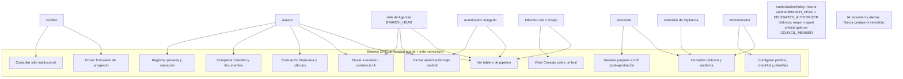

# 01 — Casos de uso (vista general)

Actores RBAC + público. Un óvalo = una intención. La IA **asiste** en revisión; no decide.

```mermaid
flowchart TB
  subgraph sistema["Sistema CRECE (landing aparte + este monorepo)"]
    UC1[Consultar sitio institucional]
    UC2[Enviar formulario de prospecto]
    UC3[Registrar persona y operación]
    UC4[Completar checklist y documentos]
    UC5[Evaluación financiera y cálculos]
    UC6[Enviar a revisión - asistencia IA]
    UC7[Firmar autorización bajo umbral]
    UC8[Votar Consejo sobre umbral]
    UC9[Ver tablero de pipeline]
    UC10[Generar paquete e IVE post-aprobación]
    UC11[Consultar bitácora y auditoría]
    UC12[Configurar política, checklist y plantillas]
  end

  Publico --> UC1
  Publico --> UC2
  Asesor --> UC3
  Asesor --> UC4
  Asesor --> UC5
  Asesor --> UC6
  Asesor --> UC9
  JefeAgencia["Jefe de Agencia BRANCH_HEAD"] --> UC6
  JefeAgencia --> UC7
  JefeAgencia --> UC9
  Delegado["Autorizador delegado"] --> UC7
  Delegado --> UC9
  Consejo["Miembro del Consejo"] --> UC8
  Consejo --> UC9
  Asistente --> UC10
  Asistente --> UC11
  Vigilancia["Comisión de Vigilancia"] --> UC11
  Admin["Administrador"] --> UC12
  Admin --> UC11

  note1["AuthorizationPolicy: menor umbral BRANCH_HEAD + DELEGATED_AUTHORIZER distintos; mayor o igual umbral quórum COUNCIL_MEMBER"]
  note2["IA: resumen y alertas. Nunca puntaje ni veredicto."]
```
