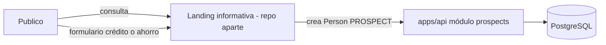

# 01a — Casos de uso landing (público)

La landing **no** vive en este repo. Contrato: POST de prospecto hacia la API cuando exista el endpoint público.

```mermaid
flowchart LR
  Publico -->|consulta| Landing[Landing informativa - repo aparte]
  Publico -->|formulario crédito o ahorro| Landing
  Landing -->|crea Person PROSPECT| API["apps/api módulo prospects"]
  API --> DB[(PostgreSQL)]
```
