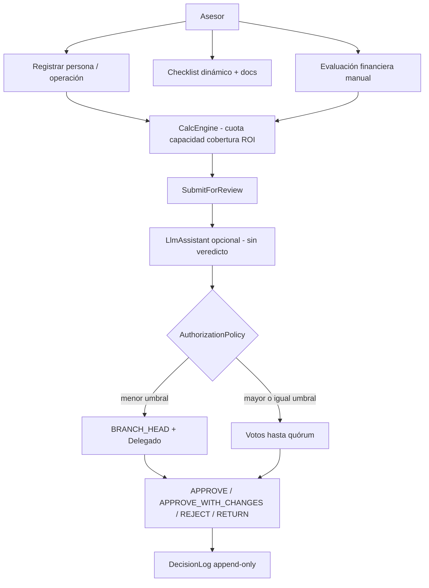

# 01b — Casos de uso crédito interno

Sistema autenticado (`apps/web` + `apps/api`).

```mermaid
flowchart TB
  Asesor --> Captura[Registrar persona / operación]
  Asesor --> Checklist[Checklist dinámico + docs]
  Asesor --> Eval[Evaluación financiera manual]
  Captura --> Calculo[CalcEngine - cuota capacidad cobertura ROI]
  Eval --> Calculo
  Calculo --> Revision[SubmitForReview]
  Revision --> IA[LlmAssistant opcional - sin veredicto]
  IA --> Auth{AuthorizationPolicy}
  Auth -->|menor umbral| Dual[BRANCH_HEAD + Delegado]
  Auth -->|mayor o igual umbral| Consejo[Votos hasta quórum]
  Dual --> Outcome[APPROVE / APPROVE_WITH_CHANGES / REJECT / RETURN]
  Consejo --> Outcome
  Outcome --> Bitacora[DecisionLog append-only]
```
