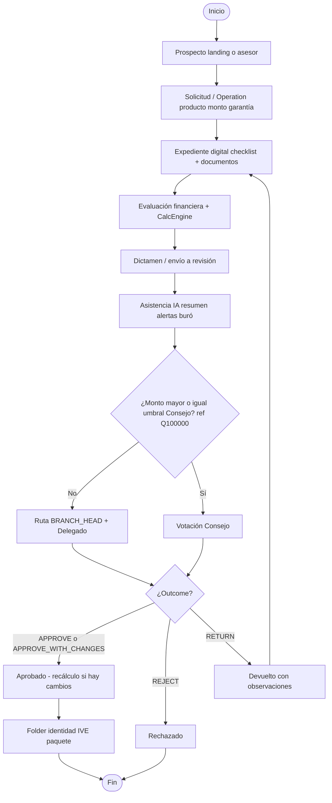

# 02 — Actividades (flujo principal)

Bifurcación por umbral. Outcomes incluyen devolver al asesor.

```mermaid
flowchart TD
  start([Inicio]) --> Prospecto[Prospecto landing o asesor]
  Prospecto --> Operacion[Solicitud / Operation producto monto garantía]
  Operacion --> Expediente[Expediente digital checklist + documentos]
  Expediente --> Eval[Evaluación financiera + CalcEngine]
  Eval --> Dictamen[Dictamen / envío a revisión]
  Dictamen --> IA[Asistencia IA resumen alertas buró]
  IA --> Umbral{¿Monto mayor o igual umbral Consejo? ref Q100000}
  Umbral -->|No| Dual[Ruta BRANCH_HEAD + Delegado]
  Umbral -->|Sí| Consejo[Votación Consejo]
  Dual --> Decision{¿Outcome?}
  Consejo --> Decision
  Decision -->|APPROVE o APPROVE_WITH_CHANGES| Aprobado[Aprobado - recálculo si hay cambios]
  Decision -->|REJECT| Rechazado[Rechazado]
  Decision -->|RETURN| Devuelto[Devuelto con observaciones]
  Devuelto --> Expediente
  Aprobado --> Cierre[Folder identidad IVE paquete]
  Rechazado --> fin([Fin])
  Cierre --> fin
```
