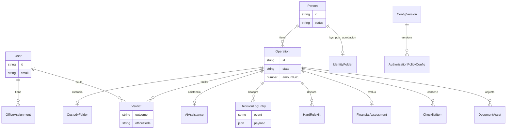

# 03 / 17 — MER inicial (persistencia ≠ dominio)

Modelo de datos objetivo. El dominio usa entidades/ports; Prisma/Drizzle (cuando se agregue) es adaptador.

```mermaid
erDiagram
  User ||--o{ OfficeAssignment : tiene
  User ||--o{ Verdict : emite
  Person ||--o{ Operation : tiene
  Person ||--o| IdentityFolder : kyc_post_aprobacion
  Operation ||--o{ DocumentAsset : adjunta
  Operation ||--o{ ChecklistItem : contiene
  Operation ||--o| FinancialAssessment : evalua
  Operation ||--o{ HardRuleHit : dispara
  Operation ||--o{ Verdict : recibe
  Operation ||--o{ DecisionLogEntry : bitacora
  Operation ||--o| AiAssistance : asistencia
  Operation ||--o| CustodyFolder : custodia
  ConfigVersion ||--o{ AuthorizationPolicyConfig : versiona

  User {
    string id
    string email
  }
  Person {
    string id
    string status
  }
  Operation {
    string id
    string state
    number amountGtq
  }
  Verdict {
    string outcome
    string officeCode
  }
  DecisionLogEntry {
    string event
    json payload
  }
```
