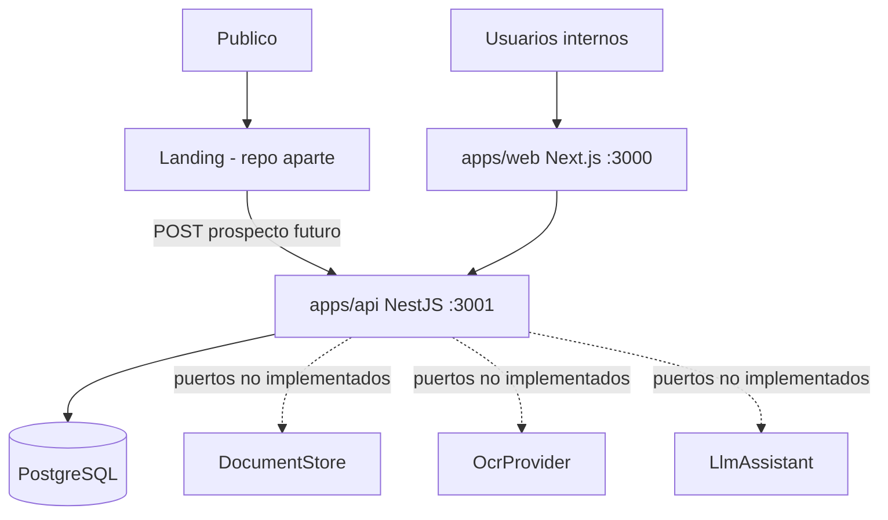

# 04 / 15 — Contenedores (greenfield)

Este repo: web :3000, api :3001, PostgreSQL. Landing es repo aparte.

```mermaid
flowchart TB
  Publico --> Landing[Landing - repo aparte]
  Internos[Usuarios internos] --> Web["apps/web Next.js :3000"]
  Landing -->|POST prospecto futuro| API["apps/api NestJS :3001"]
  Web --> API
  API --> DB[(PostgreSQL)]
  API -.->|puertos no implementados| R2[DocumentStore]
  API -.->|puertos no implementados| OCR[OcrProvider]
  API -.->|puertos no implementados| LLM[LlmAssistant]
```
