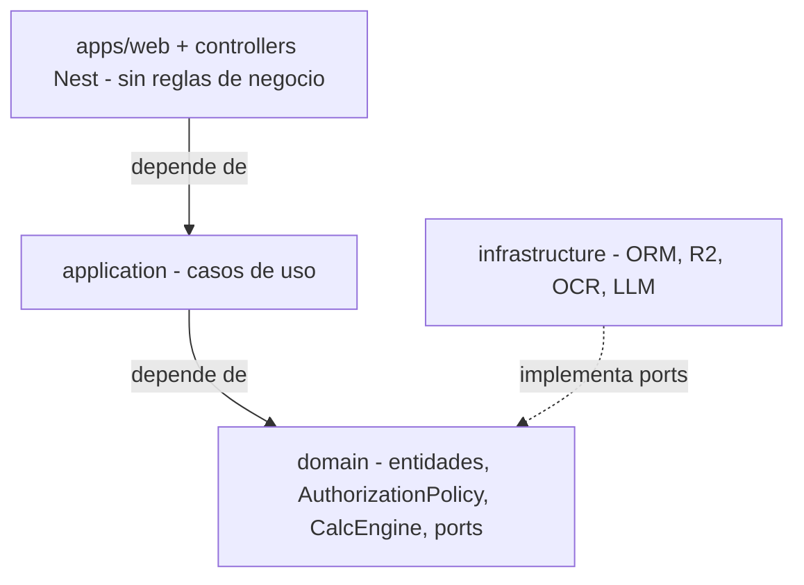
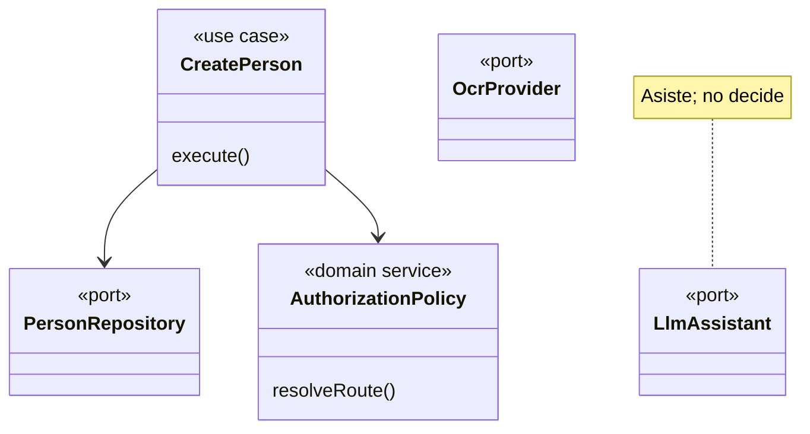

# 05 / 09 — Capas Clean / SOLID

Regla: UI → application → domain ← infrastructure. Puertos en domain **sin** prefijo `I`.

```mermaid
flowchart TB
  UI["apps/web + controllers Nest - sin reglas de negocio"] -->|depende de| APP["application - casos de uso"]
  APP -->|depende de| DOM["domain - entidades, AuthorizationPolicy, CalcEngine, ports"]
  INFRA["infrastructure - ORM, R2, OCR, LLM"] -.->|implementa ports| DOM
```

```mermaid
classDiagram
  class CreatePerson {
    <<use case>>
    execute()
  }
  class AuthorizationPolicy {
    <<domain service>>
    resolveRoute()
  }
  class PersonRepository {
    <<port>>
  }
  class LlmAssistant {
    <<port>>
  }
  class OcrProvider {
    <<port>>
  }
  CreatePerson --> PersonRepository
  CreatePerson --> AuthorizationPolicy
  note for LlmAssistant "Asiste; no decide"
```
