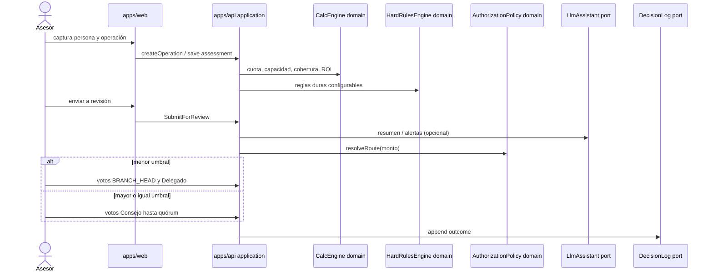

# 06 — Secuencia flujo completo

```mermaid
sequenceDiagram
  actor Asesor
  participant Web as apps/web
  participant API as apps/api application
  participant Calc as CalcEngine domain
  participant Rules as HardRulesEngine domain
  participant Policy as AuthorizationPolicy domain
  participant IA as LlmAssistant port
  participant Log as DecisionLog port

  Asesor->>Web: captura persona y operación
  Web->>API: createOperation / save assessment
  API->>Calc: cuota, capacidad, cobertura, ROI
  API->>Rules: reglas duras configurables
  Asesor->>Web: enviar a revisión
  Web->>API: SubmitForReview
  API->>IA: resumen / alertas (opcional)
  API->>Policy: resolveRoute(monto)
  alt menor umbral
    Asesor->>API: votos BRANCH_HEAD y Delegado
  else mayor o igual umbral
    Asesor->>API: votos Consejo hasta quórum
  end
  API->>Log: append outcome
```
