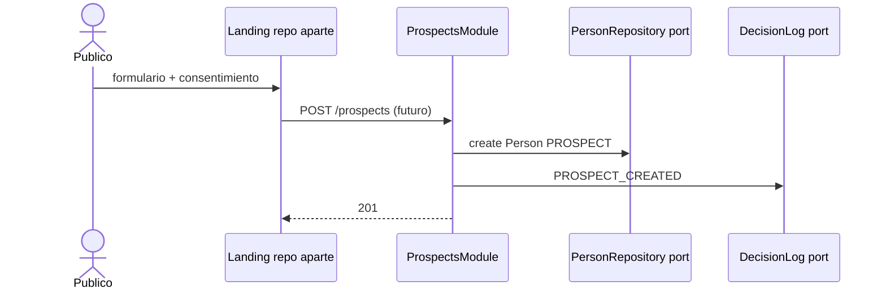

# 07 — Secuencia prospecto (landing)

```mermaid
sequenceDiagram
  actor Publico
  participant Landing as Landing repo aparte
  participant API as ProspectsModule
  participant Repo as PersonRepository port
  participant Log as DecisionLog port

  Publico->>Landing: formulario + consentimiento
  Landing->>API: POST /prospects (futuro)
  API->>Repo: create Person PROSPECT
  API->>Log: PROSPECT_CREATED
  API-->>Landing: 201
```
