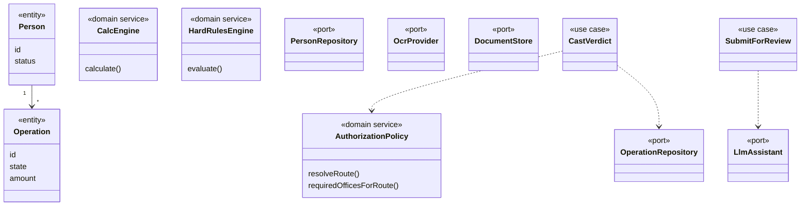

# 10–12 — Clases de dominio, application y persistencia (objetivo)

Diseño táctico de **este** greenfield. No copiar clases del MVP.

Persistencia: modelos ORM + mappers. El dominio **no** importa Prisma/Drizzle. Blobs JSON, si existen, viven en infrastructure.
