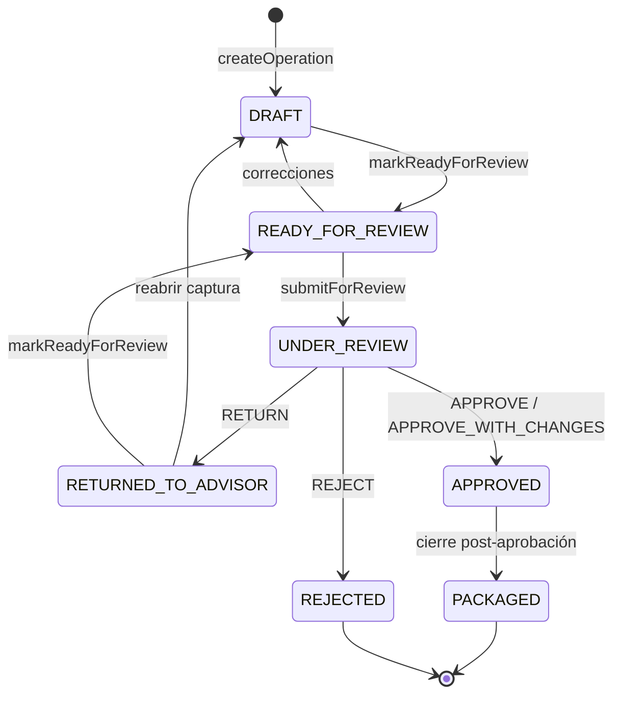

# 13 — Estados de Operation

Quien firma lo decide `AuthorizationPolicy` (umbral), **no** un estado extra.

```mermaid
stateDiagram-v2
  [*] --> DRAFT: createOperation
  DRAFT --> READY_FOR_REVIEW: markReadyForReview
  READY_FOR_REVIEW --> DRAFT: correcciones
  READY_FOR_REVIEW --> UNDER_REVIEW: submitForReview
  UNDER_REVIEW --> RETURNED_TO_ADVISOR: RETURN
  RETURNED_TO_ADVISOR --> DRAFT: reabrir captura
  RETURNED_TO_ADVISOR --> READY_FOR_REVIEW: markReadyForReview
  UNDER_REVIEW --> APPROVED: APPROVE / APPROVE_WITH_CHANGES
  UNDER_REVIEW --> REJECTED: REJECT
  APPROVED --> PACKAGED: cierre post-aprobación
  PACKAGED --> [*]
  REJECTED --> [*]
```
