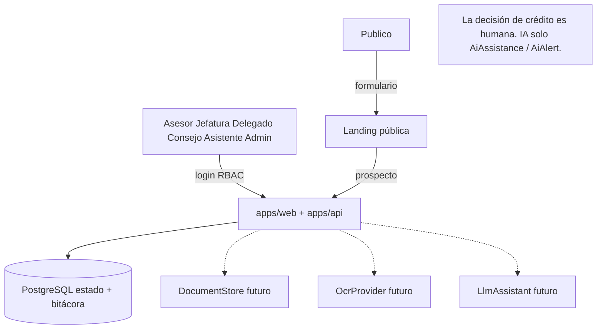

# 14 — Contexto del sistema

```mermaid
flowchart TB
  Publico -->|formulario| Landing[Landing pública]
  Staff[Asesor Jefatura Delegado Consejo Asistente Admin] -->|login RBAC| Sistema[apps/web + apps/api]
  Landing -->|prospecto| Sistema
  Sistema --> PG[(PostgreSQL estado + bitácora)]
  Sistema -.-> R2[DocumentStore futuro]
  Sistema -.-> OCR[OcrProvider futuro]
  Sistema -.-> LLM[LlmAssistant futuro]
  note["La decisión de crédito es humana. IA solo AiAssistance / AiAlert."]
```
