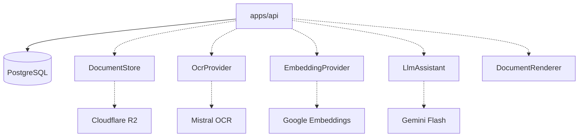

# 16 — Herramientas de terceros (solo puertos en bootstrap)

OCR/LLM **no** escriben `Verdict` ni `CalcResult`.

```mermaid
flowchart TB
  API[apps/api] --> PG[(PostgreSQL)]
  API -.-> DocumentStore
  API -.-> OcrProvider
  API -.-> EmbeddingProvider
  API -.-> LlmAssistant
  API -.-> DocumentRenderer
  DocumentStore -.-> R2[Cloudflare R2]
  OcrProvider -.-> Mistral[Mistral OCR]
  EmbeddingProvider -.-> Google[Google Embeddings]
  LlmAssistant -.-> Gemini[Gemini Flash]
```
