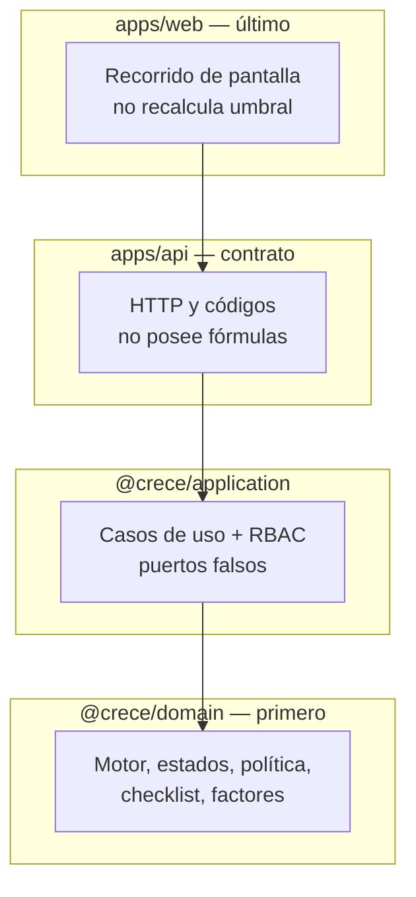
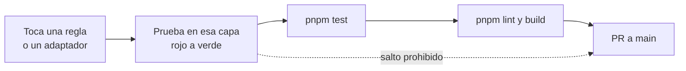
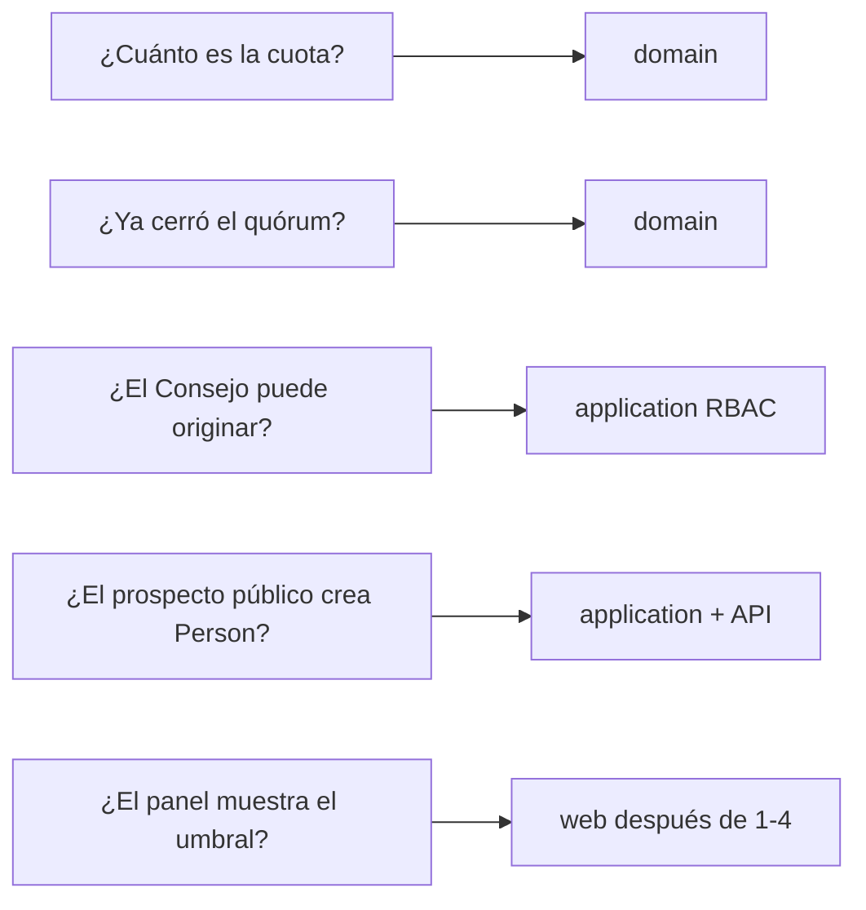
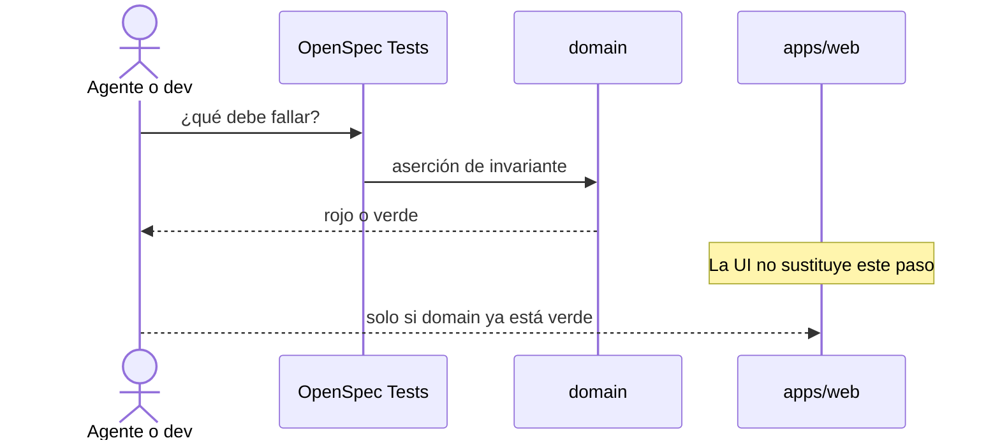
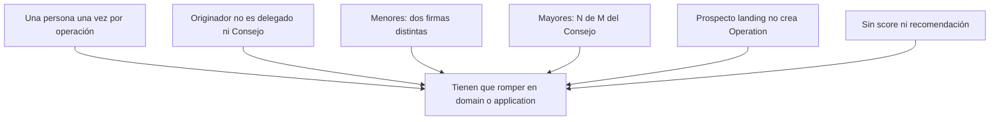

# 19 — Testing (siempre)

Fuente para agentes: **este Markdown + Mermaid**. No hay PNG. Un change sin prueba en la capa de la regla no entra a `main`. Narrativa: [testing.md](../testing.md).

## Pirámide y dueño de la regla

## Puerta de un change

## Qué capa responde a qué pregunta

## Secuencia: prueba de dominio vs atajo prohibido

## Invariantes que no se delegan a la UI

