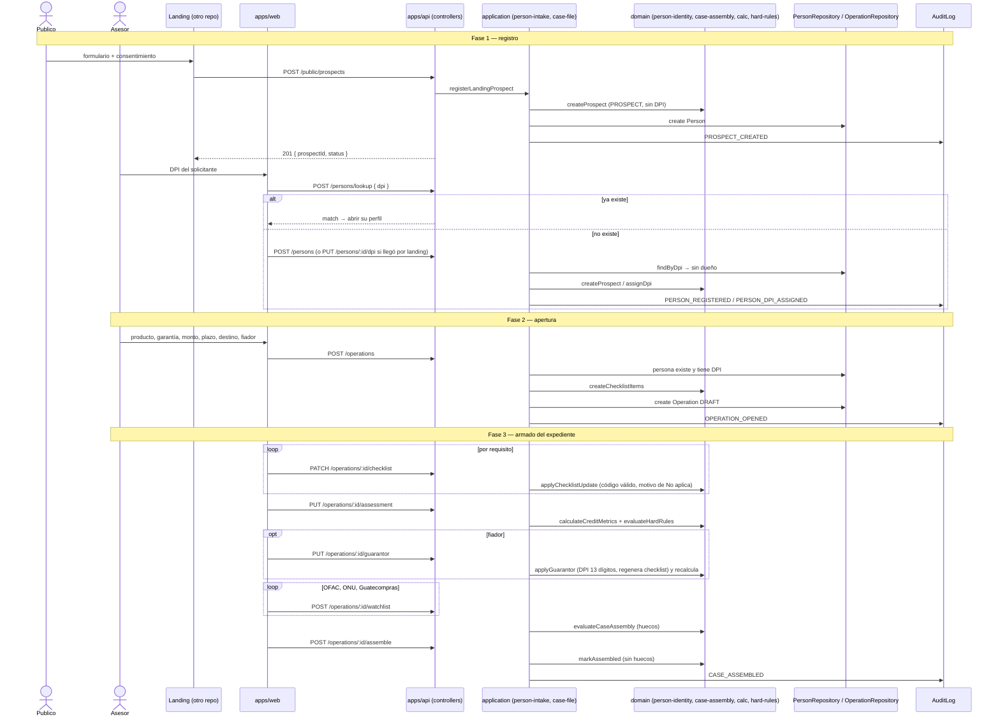

# 20 — Secuencia de captación (fases 1–3)

Detalle de las fases 1 a 3 del [flujo completo](./06-secuencia-flujo.md). Cada caso de uso exige su permiso y deja entrada en la bitácora (`AuditLog`).

```mermaid
sequenceDiagram
  actor Publico
  actor Asesor
  participant Landing as Landing (otro repo)
  participant Web as apps/web
  participant API as apps/api (controllers)
  participant App as application (person-intake, case-file)
  participant Dom as domain (person-identity, case-assembly, calc, hard-rules)
  participant Repo as PersonRepository / OperationRepository
  participant Log as AuditLog

  Note over Publico,Log: Fase 1 — registro
  Publico->>Landing: formulario + consentimiento
  Landing->>API: POST /public/prospects
  API->>App: registerLandingProspect
  App->>Dom: createProspect (PROSPECT, sin DPI)
  App->>Repo: create Person
  App->>Log: PROSPECT_CREATED
  API-->>Landing: 201 { prospectId, status }

  Asesor->>Web: DPI del solicitante
  Web->>API: POST /persons/lookup { dpi }
  alt ya existe
    API-->>Web: match → abrir su perfil
  else no existe
    Web->>API: POST /persons (o PUT /persons/:id/dpi si llegó por landing)
    App->>Repo: findByDpi → sin dueño
    App->>Dom: createProspect / assignDpi
    App->>Log: PERSON_REGISTERED / PERSON_DPI_ASSIGNED
  end

  Note over Asesor,Log: Fase 2 — apertura
  Asesor->>Web: producto, garantía, monto, plazo, destino, fiador
  Web->>API: POST /operations
  App->>Repo: persona existe y tiene DPI
  App->>Dom: createChecklistItems
  App->>Repo: create Operation DRAFT
  App->>Log: OPERATION_OPENED

  Note over Asesor,Log: Fase 3 — armado del expediente
  loop por requisito
    Web->>API: PATCH /operations/:id/checklist
    App->>Dom: applyChecklistUpdate (código válido, motivo de No aplica)
  end
  Web->>API: PUT /operations/:id/assessment
  App->>Dom: calculateCreditMetrics + evaluateHardRules
  opt fiador
    Web->>API: PUT /operations/:id/guarantor
    App->>Dom: applyGuarantor (DPI 13 dígitos, regenera checklist) y recalcula
  end
  loop OFAC, ONU, Guatecompras
    Web->>API: POST /operations/:id/watchlist
  end
  App->>Dom: evaluateCaseAssembly (huecos)
  Web->>API: POST /operations/:id/assemble
  App->>Dom: markAssembled (sin huecos)
  App->>Log: CASE_ASSEMBLED
```
