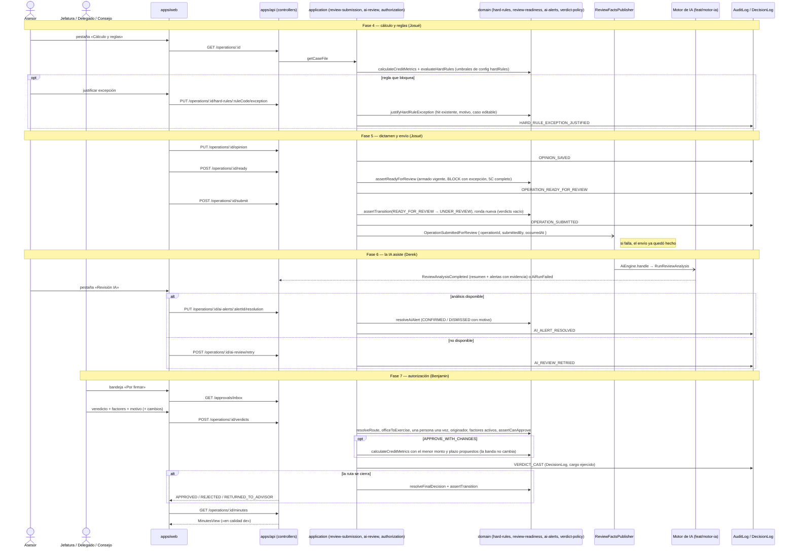

# 21 — Secuencia de revisión y autorización (fases 4–7)

Continúa la [secuencia de captación](./20-secuencia-captacion.md) desde un expediente armado. Contrato y dueños: [sprint-2.md](../sprint-2.md) y `openspec/changes/review-and-authorization/`. Todo endpoint toma el actor de la sesión (`@CurrentActor`) y cada caso de uso deja su entrada en la bitácora.

