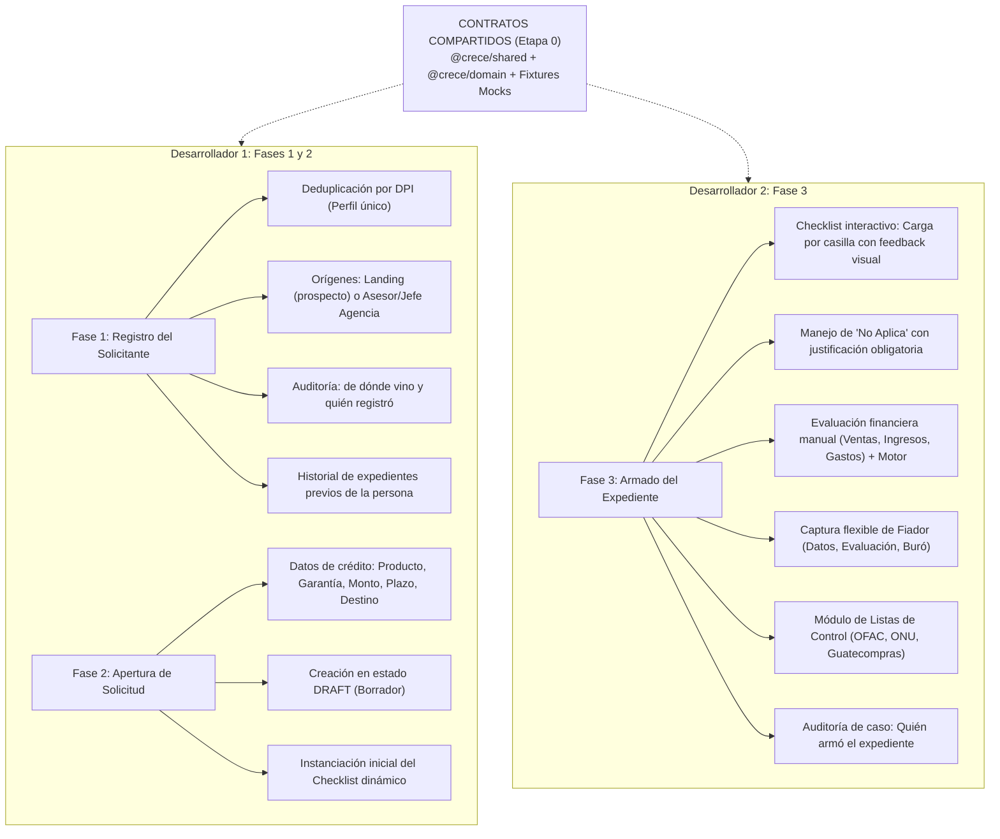
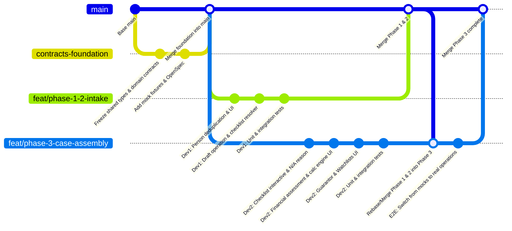

# Metodología y Plan de Trabajo Simultáneo: Fases 1, 2 y 3
**Sistema de Evaluación CRECE R.L. — Desarrollo Basado en Contratos (Contract-First)**

---

## 1. Diagnóstico del Proyecto y Repositorio

El sistema está estructurado como un **monorepo con pnpm** compuesto por:
- `packages/shared`: Tipos primitivos, marcas (`Brand`), enums, formateo GTQ y constantes globales.
- `packages/domain`: Motor de cálculo (`calc-engine`), resolución de checklist dinámico (`checklist-resolver`), máquinas de estado y reglas de negocio puras (sin dependencias de Nest ni Next).
- `packages/application`: Casos de uso y RBAC (`public-prospect`, `rbac`, orquestación).
- `apps/api`: Backend en NestJS con adaptadores HTTP y esquema Prisma PostgreSQL.
- `apps/web`: Frontend en Next.js (App Router) bajo la guía madre de diseño `design-system/` (`DESIGN.md`).
- `openspec/specs/`: Especificaciones formales del comportamiento del sistema y skills de OpenSpec (`openspec-*` en `.agents/skills/`).

### El Reto de Simultaneidad
En el ciclo de negocio tradicional, la **Fase 3** (Armado de expediente: carga de documentos, evaluación financiera, fiador, listas de control) depende de una solicitud creada en la **Fase 2** (Apertura de solicitud borrador), la cual a su vez depende de la persona registrada en la **Fase 1** (Registro del solicitante).

Para evitar que el **Desarrollador 2** espere a que el **Desarrollador 1** termine las Fases 1 y 2, se implementa una metodología **Contract-First (Desarrollo Guiado por Contratos)** donde los contratos de dominio, contratos de API, mocks y fixtures se definen y congelan en la **Etapa 0**.

---

## 2. Asignación de Responsabilidades y Alcance



| Rol | Fases | Responsabilidad Principal | Módulos API (`apps/api`) | Pantallas Web (`apps/web`) |
| :--- | :--- | :--- | :--- | :--- |
| **Desarrollador 1** | **Fase 1 & 2** | Identidad de personas, deduplicación, orígenes, apertura de operación y resolución de checklist base. | `prospects/`, `persons/`, `operations/` (POST creación borrador). | `/prospects`, `/persons`, `/persons/new`, modal o vista `/operations/new`. |
| **Desarrollador 2** | **Fase 3** | Subida de archivos, estados de checklist (N/A con razón), evaluación financiera manual, fiador y consultas OFAC/listas. | `operations/` (PATCH checklist, POST assessment, POST guarantor, POST watchlist, POST documents). | `/operations/[id]` (expediente completo: tabs checklist, finanzas, fiador, listas). |

---

## 3. Matriz de Contratos Compartidos (Etapa 0)

Ambos desarrolladores dedican las primeras horas a acordar y commitear en conjunto los tipos en `packages/shared/src/index.ts`, las entidades en `packages/domain/src/entities.ts` y las rutas de API.

### Contrato A: Registro y Consulta de Personas (Fase 1)
```typescript
// packages/shared/src/index.ts
export type PersonSource = "LANDING" | "ADVISOR";
export type ProspectInterest = "CREDIT" | "SAVINGS" | "FIXED_TERM";

export type CreatePersonDto = {
  fullName: string;
  dpi: string; // DPI único guatemalteco (13 dígitos)
  phone: string;
  email?: string;
  interest: ProspectInterest;
  source: PersonSource;
  registeredByUserId: UserId; // Quién lo registró (ej. Mario Jefe de Agencia o Asesor)
};

export type PersonSummary = {
  id: PersonId;
  fullName: string;
  dpi: string;
  phone: string;
  email?: string;
  status: PersonStatus; // PROSPECT | ACTIVE | INACTIVE
  source: PersonSource;
  registeredByUserId: UserId;
  registeredAt: string;
  operationsCount: number; // Para ver si ya tiene otros créditos/ahorros
};
```

### Contrato B: Apertura de Solicitud Borrador (Fase 2)
```typescript
// packages/shared/src/index.ts
export type CreateDraftOperationDto = {
  personId: PersonId;
  productType: ProductType;       // WORKING_CAPITAL | INVESTMENT | MICROCREDIT
  guaranteeType: GuaranteeType;   // MORTGAGE | PLEDGE | PERSONAL | MIXED
  requestedAmount: Money;         // { amount: "40000.00", currency: "GTQ" }
  termMonths: number;
  purpose: string;
  hasGuarantor: boolean;
  createdBy: UserId;
};

export type DraftOperationCreatedResult = {
  operationId: OperationId;
  personId: PersonId;
  state: "DRAFT";
  checklist: ChecklistItem[]; // Checklist generado automáticamente según producto/garantía/fiador
  createdAt: string;
};
```

### Contrato C: Armado del Expediente (Fase 3)
```typescript
// packages/shared/src/index.ts & packages/domain/src/entities.ts

// 1. Checklist y Documentos
export type UpdateChecklistItemDto = {
  operationId: OperationId;
  code: string;
  status: "UPLOADED" | "CONFIRMED" | "NOT_APPLICABLE" | "MISSING_VISIBLE";
  notApplicableReason?: string; // Obligatorio si status === "NOT_APPLICABLE"
  documentAssetId?: DocumentId;
};

// 2. Evaluación Financiera Manual
export type FinancialAssessmentDto = {
  operationId: OperationId;
  monthlySales: number;
  monthlyIncome: number;
  monthlyExpenses: number;
  existingDebtPayment: number;
  guaranteeValue?: number;
};

// 3. Fiador Opcional (Estructura flexible/tolerante)
export type GuarantorInputDto = {
  operationId: OperationId;
  fullName: string;
  dpi?: string;
  phone?: string;
  relationship?: string;
  financialAssessment?: {
    monthlyIncome: number;
    monthlyExpenses: number;
    existingDebtPayment: number;
    guaranteeValue?: number;
  };
  bureauDocAssetId?: DocumentId;
  notes?: string;
};

// 4. Listas de Control (OFAC, ONU, Guatecompras)
export type WatchlistCheckDto = {
  operationId: OperationId;
  source: "OFAC" | "ONU" | "GUATECOMPRAS";
  queryRef: string; // DPI o Nombre consultado
  result: "CLEAR" | "MATCH_FOUND" | "PENDING_MANUAL_REVIEW";
  notes?: string;
  checkedByUserId: UserId;
};

// 5. Trazabilidad de Caso
export type CaseAssemblyStatus = {
  operationId: OperationId;
  assembledByUserId: UserId;
  assembledAt?: string;
  isComplete: boolean;
  pendingRequirementsCount: number;
};
```

---

## 4. Estrategia de Desacoplamiento y Mocking para Desarrollo Simultáneo

Para que el **Desarrollador 2** empiece a programar las pantallas y endpoints de la **Fase 3** desde el minuto 1 sin esperar que el Desarrollador 1 termine el registro de personas y la creación de borradores:

### 4.1. Fixtures y Mocks Centralizados en el Proyecto
Se crea un archivo de semillas de pruebas accesible tanto por backend como frontend:
`Sistema-Evaluacion-CRECE/packages/domain/src/fixtures/mock-operations.ts`
```typescript
export const MOCK_DRAFT_OPERATION_NO_GUARANTOR: Operation = {
  id: toOperationId("mock-op-101"),
  personId: toPersonId("mock-person-001"),
  productType: "WORKING_CAPITAL",
  guaranteeType: "PERSONAL",
  hasGuarantor: false,
  requestedAmount: money(25000),
  termMonths: 18,
  purpose: "Compra de inventario de abarrotería",
  state: "DRAFT",
  checklist: createChecklistItems({
    productType: "WORKING_CAPITAL",
    guaranteeType: "PERSONAL",
    hasGuarantor: false,
  }),
  hardRuleHits: [],
  verdicts: [],
  createdBy: toUserId("user-mario-advisor"),
  createdAt: "2026-09-26T10:00:00.000Z",
  updatedAt: "2026-09-26T10:00:00.000Z",
};

export const MOCK_DRAFT_OPERATION_WITH_GUARANTOR: Operation = {
  id: toOperationId("mock-op-102"),
  personId: toPersonId("mock-person-002"),
  productType: "INVESTMENT",
  guaranteeType: "MORTGAGE",
  hasGuarantor: true,
  requestedAmount: money(75000),
  termMonths: 36,
  purpose: "Remodelación de local comercial",
  state: "DRAFT",
  checklist: createChecklistItems({
    productType: "INVESTMENT",
    guaranteeType: "MORTGAGE",
    hasGuarantor: true,
  }),
  hardRuleHits: [],
  verdicts: [],
  createdBy: toUserId("user-mario-advisor"),
  createdAt: "2026-09-26T11:00:00.000Z",
  updatedAt: "2026-09-26T11:00:00.000Z",
};
```

### 4.2. Cómo trabaja el Desarrollador 2 (Fase 3) desde el Día 1
1. **Frontend (`apps/web/app/operations/[id]`):**
   - Consume directamente `MOCK_DRAFT_OPERATION_WITH_GUARANTOR` si el backend aún no persiste operaciones completas.
   - Construye el componente de Checklist interactivo: botones para marcar estado, campo de justificación emergente si selecciona `NOT_APPLICABLE`, cargador de archivos simulado/real.
   - Construye el formulario de evaluación financiera: al ingresar ventas, ingresos y gastos, invoca en tiempo real a `calculateCreditMetrics()` de `@crece/domain`.
   - Construye la sección del Fiador y la vista de Listas de Control (OFAC, ONU, Guatecompras) con tarjetas de estado (`Sin coincidencias`, `En revisión`).
2. **Backend (`apps/api`):**
   - Implementa los endpoints `PATCH /operations/:id/checklist`, `POST /operations/:id/assessment`, `POST /operations/:id/guarantor` y `POST /operations/:id/watchlist`.
   - Utiliza una tienda en memoria (`InMemoryOperationStore`) idéntica a la que ya tiene el proyecto para prospectos (`in-memory-prospect.store.ts`), inicializada con las operaciones mock.

### 4.3. Cómo trabaja el Desarrollador 1 (Fase 1 y 2) en paralelo
1. **Frontend (`apps/web`):**
   - Trabaja en `/persons` y `/persons/new`: formulario con DPI (validación de formato 13 dígitos y no duplicación), nombre, teléfono, email, selector de producto de interés y radio de origen (Landing o Asesor con selector de quién registra).
   - Trabaja en `/operations/new` (o modal de apertura desde el perfil de la persona): selector de crédito, garantía, monto, plazo, destino y switch `¿Tiene fiador?`.
   - Al dar clic en "Crear solicitud borrador", conecta con `POST /operations`.
2. **Backend (`apps/api`):**
   - Implementa `POST /persons` (con validación de DPI único en DB o store en memoria).
   - Implementa `GET /persons/:dpi` para evitar duplicidad de perfil.
   - Conecta `POST /operations` para instanciar la `Operation` en `DRAFT` y ejecutar `createChecklistItems()` para devolver el checklist inicial.

---

## 5. Estrategia de Ramas Git y Flujo de Integración



### Reglas de Git y PRs
1. **Rama Base de Contratos (`contracts-foundation`):**
   - Dura máximo **medio día**.
   - Solo toca `packages/shared`, `packages/domain/src/entities.ts`, fixtures y specs de OpenSpec.
   - Una vez aprobada por ambos desarrolladores, se fusiona a `main`.
2. **Desarrollo en Aislamiento:**
   - Dev 1 trabaja en `feat/phase-1-2-intake`.
   - Dev 2 trabaja en `feat/phase-3-case-assembly`.
   - **Ningún desarrollador modifica contratos compartidos** sin notificar al otro. Si se requiere un cambio de contrato, se crea un PR conjunto rápido.
3. **Puerta de Pruebas Obligatoria (`docs/testing.md`):**
   - Cada PR debe incluir sus pruebas unitarias en la capa correspondiente (`@crece/domain` y `@crece/application`).
   - `pnpm test` debe ejecutarse en verde antes de solicitar revisión de código.

---

## 6. Verificación de Cumplimiento de `instrucciones.txt`

| Requisito de `instrucciones.txt` | Fase | Asignado | Estrategia Técnica |
| :--- | :--- | :--- | :--- |
| **Perfil único / No duplicación por DPI** | Fase 1 | Dev 1 | Índice único por `dpi`. Búsqueda previa al registrar; si ya existe, se asocia la nueva solicitud a la misma `PersonId`. |
| **Origen (Landing o Asesor) y Quién registró** | Fase 1 | Dev 1 | Campos `source: "LANDING" \| "ADVISOR"` y `registeredByUserId: UserId`. |
| **Datos básicos del solicitante** | Fase 1 | Dev 1 | Nombre, DPI, teléfono, correo, producto de interés (`CREDIT`, `SAVINGS`, `FIXED_TERM`). |
| **Apertura en borrador (`DRAFT`)** | Fase 2 | Dev 1 | `OperationState = "DRAFT"`. No avanza a revisión automáticamente. |
| **Requisitos dinámicos según producto, garantía y fiador** | Fase 2 | Dev 1 | Utiliza `createChecklistItems()` de `@crece/domain/src/checklist-resolver.ts`. |
| **Subir cada documento a su casilla** | Fase 3 | Dev 2 | Componente de casillas por código de checklist con estado visual (`PENDING`, `UPLOADED`, `CONFIRMED`). |
| **Marcar "No Aplica" con justificación obligatoria** | Fase 3 | Dev 2 | Diálogo/modal que bloquea guardar `NOT_APPLICABLE` si el campo `notApplicableReason` está vacío (cumple regla de `checklist-resolver.ts`). |
| **Evaluación financiera manual** | Fase 3 | Dev 2 | Formulario de captura de ventas, ingresos, gastos y deudas. Muestra resultados de cálculo en tiempo real con etiqueta de "Calculado" vía `calc-engine.ts`. |
| **Fiador opcional y flexible** | Fase 3 | Dev 2 | Sección colapsable/opcional si `hasGuarantor` es true. Almacena en `guarantorJson` y `guarantorAssessmentJson` con tolerancia a datos parciales. |
| **Listas de control (OFAC, ONU, Guatecompras)** | Fase 3 | Dev 2 | Vista clara de consulta y estatus (modelo `WatchlistCheck` en Prisma). Registro visual limpio con estado pendiente o verificado. |
| **Trazabilidad de armado de caso** | Fase 3 | Dev 2 | Campo `assembledBy: UserId` y registro de auditoría (`DecisionLogEntry` / `AuditEntry`). |

---

## 7. Cronograma Operativo Recomendado

### Día 1: Congelamiento de Contratos y Scaffold de Mocks
- **Mañana (Conjunto Dev 1 + Dev 2):**
  - Revisar y aprobar tipos en `packages/shared`.
  - Crear fixtures en `packages/domain/src/fixtures`.
  - Crear OpenSpec change de la integración.
  - Merge a `main`.
- **Tarde (Separación de ramas):**
  - Dev 1: Inicia `apps/api/src/modules/persons` y página de registro `/persons/new`.
  - Dev 2: Monta `/operations/[id]` consumiendo la operación mock y diseña el componente de checklist interactivo con Design System.

### Día 2: Implementación Core de Funcionalidades
- **Dev 1:**
  - Lógica de deduplicación de persona por DPI.
  - Formulario de apertura de crédito (tipo, garantía, monto, plazo, destino, fiador).
  - Conexión con `createChecklistItems`.
  - Pruebas unitarias de deduplicación y apertura en borrador.
- **Dev 2:**
  - Carga de documentos y modal de justificación para "No Aplica".
  - Formulario de evaluación financiera conectada a `calculateCreditMetrics`.
  - Formulario opcional de fiador.
  - Sección UI de listas de control (OFAC/ONU/Guatecompras).
  - Pruebas unitarias de validación de checklist y justificación de N/A.

### Día 3: Integración E2E y Pruebas
- **Mañana:**
  - Merge de `feat/phase-1-2-intake` a `main`.
  - Dev 2 actualiza su rama `feat/phase-3-case-assembly` contra `main`.
  - Dev 2 desactiva los mocks y conecta `/operations/[id]` con las operaciones reales creadas en Fase 2.
- **Tarde:**
  - Prueba de flujo continuo: Registrar prospecto/persona -> Abrir crédito borrador con garantía y fiador -> Llenar expediente, cargar docs, justificar N/A, evaluar finanzas y revisar listas.
  - Ejecución de la suite completa de pruebas: `pnpm test`.
