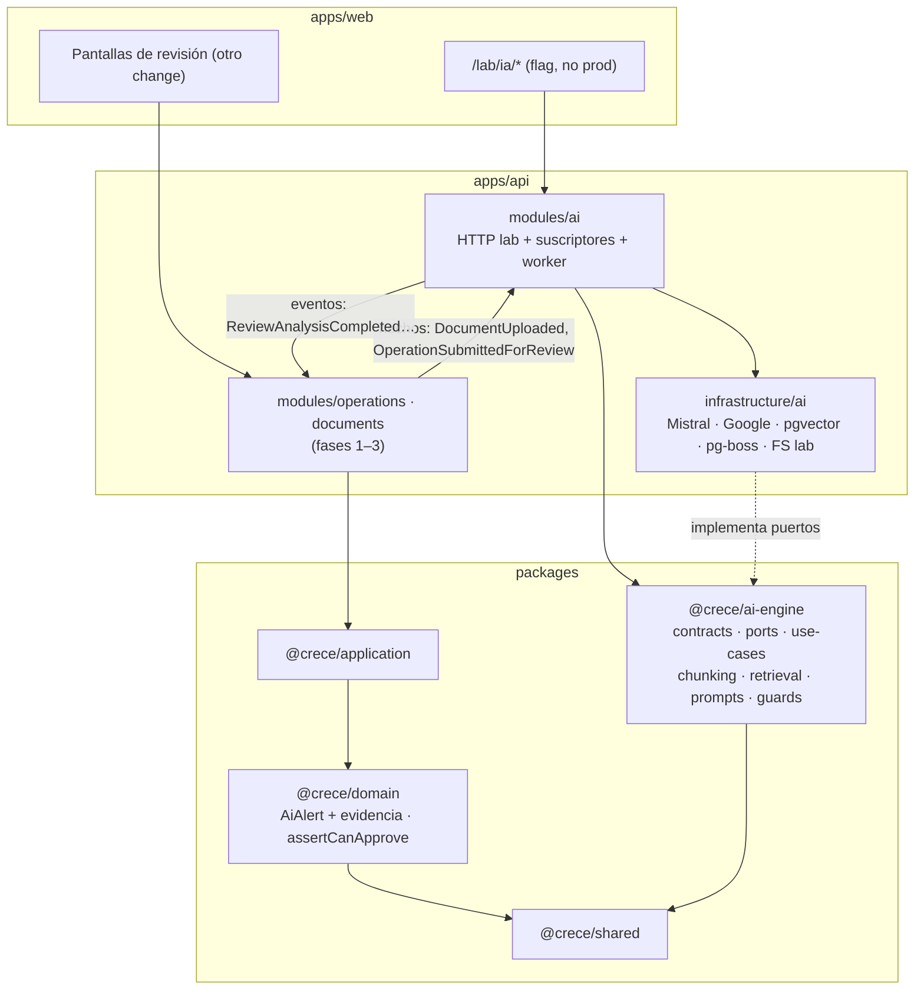
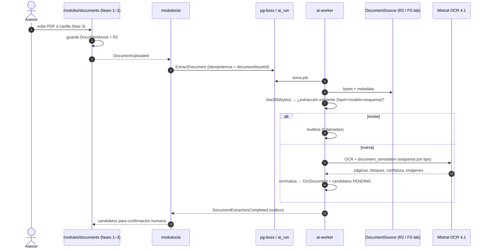
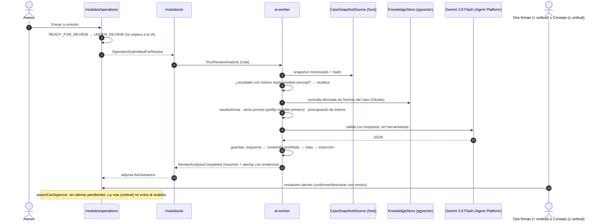
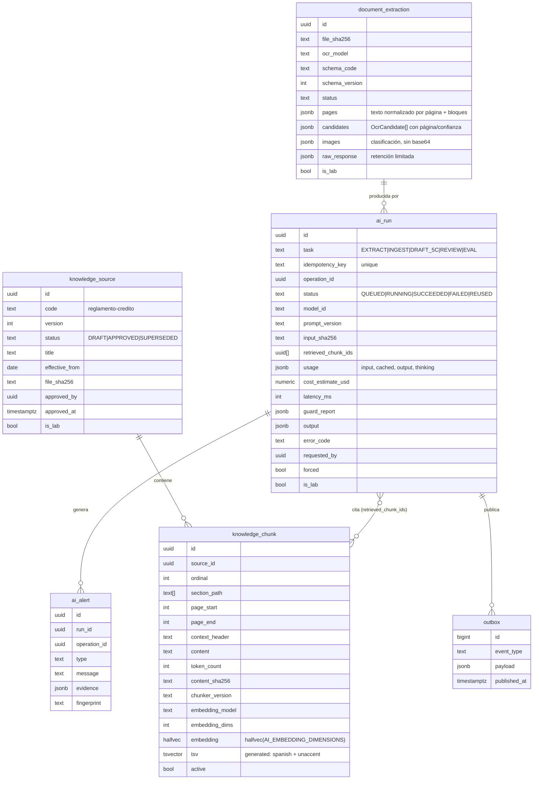
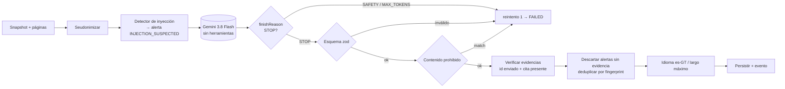

## Context

Motivación: ver `proposal.md` (Why). Requisitos: `specs/*/spec.md` de este change.

Estado actual relevante:

- Los puertos de IA (`OcrProvider`, `LlmAssistant`, `EmbeddingProvider`, `RagStore`) viven en `packages/domain/src/ports.ts`, sin implementación. Su forma pierde procedencia y envía la `Operation` completa (con PII) al LLM.
- `AiAlert.sourceDocumentId` es obligatorio. `assertCanApprove` existe en `packages/domain/src/verdict-policy.ts`, pero no tiene test.
- Prisma (`apps/api/prisma/schema.prisma`) guarda `aiAssistanceJson` y `ocrArtifactsJson` como JSON. El cliente Prisma aún no está cableado al runtime, y ese trabajo es de las fases 1–3, igual que R2.
- La base es `postgres:18-alpine`, que no trae pgvector. Node ≥ 22 (Docker 24). TypeScript 7 (sin typescript-eslint; `lint` = `tsc --noEmit`).
- El diagrama madre del flujo es `docs/diagramas/06-secuencia-flujo-completo.png`. El Mermaid `06-secuencia-flujo.md` está incompleto (lo actualiza la tarea de docs).

Decisiones ya tomadas por el coordinador de IA (no se re-litigan aquí):

- OCR con Mistral.
- Embeddings con `gemini-embedding-2`, con la dimensión como variable global.
- `gemini-3.8-flash` para todas las tareas LLM.
- Gemini Enterprise Agent Platform (ex Vertex AI) con **API key** atada a service account, dejando abierta la opción de cambiar de backend.
- Sin LangChain.
- Cuentas de prueba en todos los proveedores.

## Goals / Non-Goals

**Goals:**

- Un módulo de IA que se pueda desarrollar, probar y desplegar sin tocar el código de las fases 1–3, y que ellas consuman solo por contrato.
- Cada etapa (OCR, chunking, búsqueda, generación) se puede observar y medir por separado en el laboratorio antes de integrar.
- Seguridad por arquitectura: el modelo no puede actuar. Las guardas son código determinístico, no instrucciones al modelo.
- Costo mínimo: no pagar dos veces el mismo trabajo, aprovechar el caché implícito y medir costo por caso.
- Cambiar de modelo, de dimensión o de backend es un cambio de configuración más una evaluación, no un cambio de código.

**Non-Goals:**

- Diseñar la UI de revisión de producción (pantallas C-08 y D-*). Aquí solo se diseña el lab. La UI de producción consumirá los mismos contratos en otro change.
- Implementar R2, auth de sesión o la persistencia Prisma de operaciones.
- Caché explícito de Gemini, fine-tuning, re-ranking con un modelo adicional o búsqueda multimodal (se reevalúan con datos del lab).

## Decisions

### D1. Bounded context en su propio paquete



- `@crece/ai-engine` depende **solo** de `@crece/shared`. No depende de `@crece/domain`, para que el motor no se acople a las entidades de crédito. Traduce desde su propio `CaseSnapshot`.
- El paquete publica `exports` con dos entradas: `.` (contratos, puertos y fábrica de casos de uso) y `./testing` (fakes). Lo interno no es importable.
- `modules/ai` es el único *composition root*: instancia los casos de uso con los adaptadores. Es el único lugar que conoce Nest y los SDKs.
- En `@crece/domain` queda solo lo que el proceso de crédito necesita saber de la IA: `AiAlert` con evidencias, la resolución de alertas y `assertCanApprove`.

**Alternativas descartadas:**

- *Poner el motor dentro de `@crece/application`:* mezcla dueños y ciclos de cambio, y no permite forzar la frontera.
- *Microservicio aparte:* agrega red, despliegue y auth entre servicios sin beneficio a este volumen. Con la frontera del paquete, y el worker como proceso separado, se puede extraer después sin reescribir.

### D2. Integración: hechos entran, eventos salen, trabajo en cola

- **Hechos del anfitrión** (tipos publicados en `contracts`, emitidos por las fases 1–3):
  - `DocumentUploaded { documentAssetId, operationId, checklistCode, documentType }`
  - `OperationSubmittedForReview { operationId }`
  - `CaseSnapshotChanged { operationId }` (opcional; para marcar análisis desactualizados)
- **Comandos** (los traducen `modules/ai` o el lab): `ExtractDocument`, `IngestKnowledgeSource`, `SearchKnowledge`, `RequestDraft5C`, `RunReviewAnalysis`.
- **Eventos del motor:** `DocumentExtractionCompleted`, `KnowledgeSourceIndexed`, `Draft5CReady`, `ReviewAnalysisCompleted`, `AiRunFailed`.
- **Mecánica:**
  1. El comando inserta un `ai_run` (estado `QUEUED`) y un job en **pg-boss**, en la misma transacción. La clave de idempotencia es un índice único en `ai_run`.
     - La transacción es la del store: el motor recibe una `Transaction` opaca y se la pasa a `JobQueue.enqueue` (pg-boss `send(..., { db })`). Si encolar falla, la ejecución tampoco existe: nunca queda un `QUEUED` huérfano.
     - La clave de idempotencia es un índice único **parcial** (`WHERE status <> 'FAILED'`): una ejecución fallida no bloquea su clave, así que volver a pedir la misma extracción (o `retryRun`) crea una nueva, enlazada por `retry_of`.
  2. El **worker** *reclama* la ejecución con compare-and-set (`QUEUED → RUNNING`, o `RUNNING` con `started_at` anterior al plazo `runs.leaseSeconds`, igual a la expiración del job en pg-boss). Dos workers, o una reentrega de la cola, nunca llaman dos veces al proveedor. Termina escribiendo el resultado y una fila en `ai.outbox` en una transacción, solo si sigue `RUNNING`.
  3. Un *relay* en el proceso **API** publica los eventos del outbox al bus in-process (`AI_EVENTS`), con `FOR UPDATE SKIP LOCKED` (varias instancias sin duplicar). Entrega "al menos una vez": cada evento lleva `eventId` y `schemaVersion`, y el consumidor deduplica por `eventId`. Un evento cuyo consumidor falla se reintenta; tras 10 intentos queda descartado (`dead_at`) y se registra. Sin suscriptores, los eventos esperan (no se marcan publicados).
  4. Un **barrido** en el worker (cada minuto) marca `FAILED` con `AI_RUN_INTERRUPTED` (reintentable, con su evento) lo que siga `QUEUED`/`RUNNING` pasado `runs.stalledAfterSeconds`: ninguna ejecución queda "procesando" para siempre. El mismo barrido purga `raw_response` vencida.
  5. Los hechos del anfitrión entran por **`AiEngine.handle(fact)`**: el mapeo hecho → comando vive y se prueba en el motor. El anfitrión ya autorizó la acción que originó el hecho, así que no se reevalúa el cargo (se registra quién la originó). Un hecho que todavía no dispara trabajo devuelve `null` y el anfitrión muestra "Análisis de IA no disponible".
- **Worker:** la misma imagen de `apps/api` con `AI_WORKER=true`, que arranca un contexto Nest sin HTTP. En Compose es un servicio `ai-worker` en el perfil `dev`. Late cada 15 s en `ai.worker_heartbeat`; la API expone la salud (cola, en curso, workers vivos) y el lab avisa "no hay worker" en vez de dejar una ejecución "en cola" sin explicación. Concurrencia desde `ai.config` (`runs.workerConcurrency`).





El borrador 5C sigue el mismo camino, pero lo dispara el botón (`RequestDraft5C`) y emite `Draft5CReady`. No persiste nada en `Operation.opinion`.

### D3. Proveedores y autenticación

- **Google (embeddings y LLM):** una sola `GoogleClientFactory` en `infrastructure/ai` crea el cliente `@google/genai`.

  | Variable | Valores | Default |
  |---|---|---|
  | `AI_GOOGLE_BACKEND` | `agent-platform` \| `developer-api` | `agent-platform` |
  | `AI_GOOGLE_AUTH` | `api-key` \| `adc` | `api-key` |
  | `AI_GOOGLE_API_KEY` | secreto | — |
  | `AI_GOOGLE_PROJECT`, `AI_GOOGLE_LOCATION` | proyecto y región | — |

  - Con `agent-platform` se inicializa con `enterprise: true`.
  - La key es una *authorization key* atada a una service account con solo permiso de invocar modelos, `--api-target=service=aiplatform.googleapis.com` y restricción por IP del servidor.
  - Requiere relajar la política de organización `iam.managed.disableServiceAccountApiKeyCreation` en el proyecto de prueba (lo hace el coordinador en GCP).
  - Por qué API key y no ADC en esta etapa: el equipo trabaja con cuentas de prueba y el servidor es un VPS fuera de GCP. ADC ahí implicaría distribuir un JSON de service account, que es peor. El cambio a ADC o Workload Identity Federation queda a una variable de distancia.
- **Mistral (OCR):** `@mistralai/mistralai` directo contra la API de Mistral, con `MISTRAL_API_KEY`.
  - Se **fija la versión** del modelo en configuración: `mistral-ocr-4-1` (OCR 4.1, GA 2026-08-31). Nunca `mistral-ocr-latest` ni `mistral-ocr-4`: son alias que cambian de modelo sin aviso (hoy apuntan a 4.1; la 4.0 se retiró el 2026-09-30) y la reproducibilidad y la deduplicación dependen de la versión. La configuración rechaza cualquier id `*-latest` al arrancar y el adaptador rechaza además los alias de versión mayor.
  - *Alternativa descartada:* Mistral OCR 25.05 vía Model Garden de Agent Platform. Es una versión anterior, sin confianza por bloque, y hay reportes de error 500 con `document_annotation_format`. Queda como adaptador alternativo posible.
- **Puertos del motor** (interfaces pequeñas, sin prefijo `I`):

  | Puerto | Firma |
  |---|---|
  | `OcrProvider` | `extract(file, schema?) → OcrDocument` |
  | `EmbeddingProvider` | `embedDocuments(texts[], dims)`, `embedQuery(text, dims)` |
  | `LlmProvider` | `generateStructured({ system, contents, schema, limits }) → { json, usage, finishReason }` |
  | `KnowledgeStore` | `upsertSource`, `upsertChunks`, `activateVersion`, `search` |
  | `RunStore`, `ExtractionStore`, `ResultCache`, `EventOutbox`, `Clock`, `IdGenerator`, `JobQueue` | — |

  Del anfitrión: `DocumentSource`, `CaseSnapshotSource`.
- **Formato de embeddings:** Gemini Embedding 2 no usa `task_type`, sino prefijos en el texto (p. ej. `task: search result | query: …` para consultas). El adaptador es el único dueño de ese formato. El formato exacto para documentos se toma de la documentación vigente y se fija con un test de contrato.

### D4. Modelo de datos (esquema `ai`)



Además: `ai.result_cache` (clave → run; también embeddings de consulta), `ai.config` (versionada, con auditoría), `ai.worker_heartbeat` y `ai.schema_migrations`.

Migración `002-run-lifecycle` (sobre 001, que ya estaba aplicada): índice de idempotencia parcial (sin `FAILED`), `ai_run.retry_of`, `document_extraction.pipeline_fingerprint` e `injection_suspected` con clave única `(file_sha256, ocr_model, pipeline_fingerprint, is_lab)`, `outbox.attempts/last_error/dead_at` y `worker_heartbeat`.

- **Resolución de alertas:** la resolución la registra el proceso de crédito (dominio y auditoría old/new), no el motor. `ai_alert` es la copia inmutable de lo que dijo la IA. El dominio guarda la resolución referenciando `ai_alert.id`.
- **Migraciones propias del esquema `ai`**, en SQL embebido en módulos TS (`apps/api/src/infrastructure/ai/db/migrations/NNN-*.ts`, porque `tsc` no copia `.sql` a `dist`), con un migrador mínimo (advisory lock, checksum sobre la plantilla, guarda de dimensión) y un cliente `pg` propio. No pasan por Prisma. Las semillas de configuración viven en código etiquetadas como seed; `ai.config` guarda solo lo que un administrador cambia. Motivos:
  1. La dimensión del vector es parámetro de la migración (`halfvec(${AI_EMBEDDING_DIMENSIONS})`).
  2. Prisma no modela `halfvec`, HNSW ni columnas generadas `tsvector`.
  3. No bloquea ni choca con el cableado de Prisma de las fases 1–3.

  *Costo:* dos mecanismos de migración en la misma base, en esquemas separados. Queda documentado en `docs/arquitectura.md`.
- **Optimización de datos:**
  - `halfvec` (2 bytes por dimensión) en lugar de `vector` (4): mitad de disco y RAM de índice, con pérdida de precisión despreciable.
  - Se guardan clasificación y posición de las imágenes, **nunca su base64**; los binarios quedan en R2.
  - `raw_response` se purga tras N días; lo normalizado permanece.
  - `default_toast_compression = lz4` para `jsonb` y textos largos.
  - Índices parciales `WHERE active`. Columna `tsvector` generada y almacenada, con índice GIN.
  - Deduplicación por `file_sha256` (extracción) y `content_sha256` (chunks).

### D5. Pipeline de extracción

1. **Validación previa** (sin costo): MIME real por *magic bytes*, tamaño, cifrado y páginas contadas con un parser real (`pdf-lib`, puro JS), también en PDFs con *object streams* y xref comprimido (lo común en estados de cuenta). Un PDF cuya estructura no se puede leer se rechaza (`AI_INPUT_CORRUPT`, "vuelve a exportarlo o sube una foto"); nunca se le pide al proveedor un rango de páginas adivinado. Si falla, `FAILED` con motivo y sin llamada al proveedor.
2. **Deduplicación** por `(file_sha256, ocr_model, pipeline_fingerprint, is_lab)`. La huella es el hash de todo lo que determina el resultado: versión del pipeline (`extract-v2`), esquema y prompt de anotación, tipos de campo, clasificador de imágenes e `image_min_size`. Editar la descripción de un campo invalida la deduplicación sin depender de subir una versión a mano. El laboratorio y producción **nunca** comparten extracciones.
3. **Llamada a Mistral:** `extract_header`/`extract_footer` activos, confianza por bloque, `image_min_size` para ignorar miniaturas, `table_format` markdown. `document_annotation_format` = esquema JSON del tipo de documento, y `bbox_annotation_format` = clasificador de imágenes (tipo, relevante, descripción). Las anotaciones solo se piden para los tipos que las necesitan.
4. **Traducción anticorrupción** → `OcrDocument` propio (páginas, bloques con posición y confianza, imágenes clasificadas). Ningún tipo de Mistral sale del adaptador.
5. **Normalización:** Unicode NFC, quitar caracteres invisibles y de control de dirección (U+00AD, U+200B–200F, U+202A–202E, U+2060–2064, U+2066–2069, U+FEFF), unir palabras partidas por guion al final de línea, colapsar espacios, quitar números de página, y un mapa de posición de texto → página y bloque.
   - Los marcadores de imagen se **quitan** del texto. La descripción de una imagen la escribe el modelo de OCR: vive en `images`, se muestra como "descripción del modelo" y nunca sirve como cita de evidencia.
   - **Señales de inyección al extraer** (fase 3, no solo en la revisión): el detector corre sobre texto, encabezado, pie y descripciones de imágenes de cada página. Las señales quedan en `pages[].injectionSignals`, la extracción en `injectionSuspected` y el evento `DocumentExtractionCompleted` en `injectionSuspected`. Los candidatos ubicados en una página con señales quedan "Revisar". Es aviso, no bloqueo: el texto sigue ahí como dato.
6. **Candidatos:** del `document_annotation` al `OcrCandidate` del dominio (`PENDING`, página, región `bbox` del bloque, confianza, marca de baja confianza según umbral configurable). Un valor que no aparece en el texto se marca (posible alucinación de la anotación).
   - Montos GTQ con formato es-GT: "Q12,500.00". Se tolera "12.500,00" y se marca para revisión.
   - Fechas en dd/mm/aaaa.
   - DPI/CUI: 13 dígitos, se valida el formato. Nunca se "corrige" el valor, solo se marca.
7. **Costo:** páginas procesadas × precio; con anotaciones (campos o clasificación de imágenes) se usa la tarifa de páginas anotadas (`prices.ocrAnnotatedUsdPerPage`, US$5/1,000 en OCR 4.1) y sin ellas la de OCR simple (US$4/1,000). Ambos son configuración.
8. **Límite conocido:** un PDF con contraseña de propietario pero sin contraseña de apertura (común en estados de cuenta bancarios) también trae `/Encrypt` y se rechaza como "PDF protegido". Distinguirlo exige implementar el manejador de seguridad estándar del PDF; se reevalúa con datos del lab.

**Registro de esquemas por tipo** (OCP: agregar un tipo no modifica código existente), versión inicial:

| Tipo | Campos |
|---|---|
| `DPI` | nombre, CUI, fecha de nacimiento, vencimiento |
| `BUREAU_REPORT` | deudas vigentes, cuota mensual total, máxima mora en meses, número de consultas |
| `INCOME_RECEIPT` | emisor, periodo, monto |
| `BANK_STATEMENT` | periodo, saldo promedio, depósitos |
| `UTILITY_BILL` | dirección, fecha |
| `BUSINESS_PHOTO` / `SKETCH` | solo descripción |

### D6. Chunking de políticas

Por qué no un splitter genérico por caracteres: un reglamento se cita por artículo, y cortar por caracteres produce pedazos que mezclan dos artículos o parten una tabla, lo que degrada la búsqueda y las citas.

**Algoritmo** (`chunker_version = "struct-v1"`):

1. **Parseo** del markdown normalizado con `markdown-it` (tabla GFM incluida) a un flujo de bloques con número de línea: encabezados, párrafos, listas y tablas.
   - *Por qué no `unified`/`remark`:* son solo ESM, y `@crece/ai-engine` compila a CommonJS como el resto de paquetes. `markdown-it` publica entrada CommonJS con tipos y no tiene dependencias nativas.
   - Los números de línea (`token.map`) permiten volver al mapa de posición → página del normalizador.
2. **Promoción de encabezados legales.** El OCR no siempre emite `#`, así que un párrafo que empieza con uno de estos patrones se promueve a encabezado del nivel correspondiente:
   - `^(TÍTULO|TITULO)\s+[IVXLC\d]+`
   - `^(CAPÍTULO|CAPITULO)\s+[IVXLC\d]+`
   - `^(SECCIÓN|SECCION)\s+`
   - `^Art(í|i)culo\s+\d+[.º°]?`
   - `^ANEXO\s+`
3. **Árbol de secciones.** Cada nodo lleva su ruta (`["Reglamento de Crédito v3", "Capítulo II", "Artículo 12"]`) y su rango de páginas.
4. **Empaquetado.** La unidad natural es la sección hoja (normalmente un artículo). Parámetros en `ai.config`:

   | Parámetro | Valor inicial |
   |---|---|
   | `targetTokens` | 450 |
   | `maxTokens` | 700 |
   | `minTokens` | 80 |
   | `overlapSentences` | 1 |

   - Una hoja de hasta `maxTokens` es un chunk.
   - Hojas consecutivas por debajo de `minTokens` **del mismo padre** se agrupan hasta `targetTokens`. Nunca se cruza un capítulo.
   - Una hoja de más de `maxTokens` se corta por párrafo, luego por oración con `Intl.Segmenter('es', { granularity: 'sentence' })`, con protección de abreviaturas ("Art.", "No.", "Lic.", "Q.", "Inc."). Se repite `overlapSentences` entre partes.
   - **Tablas:** son atómicas. Si superan `maxTokens`, se cortan por filas y cada parte repite la fila de encabezado.
   - **Documento sin estructura detectable:** se usa el fallback por párrafos con los mismos límites, y la fuente queda marcada `structure=flat` para verla en el lab.
5. **Encabezado de contexto:** `context_header = "<título de la fuente> (v<versión>, vigente desde <fecha>) › <ruta>"`. Se antepone solo al texto que se envía a embeddings y a la búsqueda de texto. `content` se guarda limpio para mostrarlo y verificar citas.
6. **Conteo de tokens:** estimador local calibrado para español. El lab lo contrasta con `countTokens` del proveedor y ajusta el factor. No se llama al proveedor por cada chunk en producción.
7. **Invariantes** (tests con casos fijos y *property-based*): longitud máxima, tablas no partidas, ruta y páginas presentes, reconstrucción sin pérdida (la concatenación de `content`, sin solapes, es igual al texto normalizado) y determinismo.

**Contenido del corpus inicial** (lo provee la cooperativa):

- Reglamento de crédito.
- Manual o política de crédito.
- Vocabulario de factores de decisión: como texto descriptivo, **sin pesos**.
- Reglas citadas de CRECE (p. ej. "una garantía no compensa la falta de flujo").
- Criterios de checklist por producto y garantía.

Las fuentes "fijadas" (vocabulario y reglas base) van siempre en el prefijo del prompt (D9). El resto se recupera por búsqueda.

### D7. Embeddings e índice

- **Dimensión:** `AI_EMBEDDING_DIMENSIONS` es una variable global de entorno, **por defecto 1536**.
  - Rango permitido: 128–2000, que es el límite de HNSW para `vector`; `halfvec` admite más, pero no se necesita.
  - Google recomienda 768, 1536 o 3072. 3072 se descarta por costo de almacenamiento e índice sin ganancia medible en un corpus pequeño.
  - El lab compara 768, 1024 y 1536 con el set de evaluación antes de fijar el valor de producción.
  - Gemini Embedding 2 normaliza automáticamente al truncar, así que coseno y producto interno son equivalentes.
- **Cambio de dimensión o modelo:** se crea una tabla de chunks nueva con la nueva columna, se reindexa en batch y luego se cambia atómicamente la vista `ai.knowledge_chunk_active`. Mientras la configuración y el índice no coincidan, la búsqueda falla con "reindexación requerida" (spec `ai-knowledge-base`).
- **Índice:** HNSW `halfvec_cosine_ops` (`m=16`, `ef_construction=64`) y GIN sobre `tsv`.
  - Con menos de ~5,000 chunks activos, el lab mide si un escaneo exacto es igual de rápido. HNSW se mantiene porque el costo de mantenerlo es trivial y escala.
  - Se activa `hnsw.iterative_scan = relaxed_order` para que el filtro `active AND status = APPROVED` no deje menos de *k* resultados.
- **Búsqueda híbrida en una consulta** (RRF, `k = 60`):

```sql
WITH q AS (SELECT $1::halfvec AS emb, websearch_to_tsquery('spanish', unaccent($2)) AS tsq),
sem AS (
  SELECT id, row_number() OVER (ORDER BY embedding <=> (SELECT emb FROM q)) AS r
  FROM ai.knowledge_chunk_active
  ORDER BY embedding <=> (SELECT emb FROM q) LIMIT $3            -- p. ej. 20
),
lex AS (
  SELECT id, row_number() OVER (ORDER BY ts_rank_cd(tsv, (SELECT tsq FROM q)) DESC) AS r
  FROM ai.knowledge_chunk_active
  WHERE tsv @@ (SELECT tsq FROM q)
  ORDER BY ts_rank_cd(tsv, (SELECT tsq FROM q)) DESC LIMIT $3
)
SELECT id,
       COALESCE($4 / (60 + sem.r), 0) + COALESCE($5 / (60 + lex.r), 0) AS fused
FROM sem FULL OUTER JOIN lex USING (id)
ORDER BY fused DESC LIMIT $6;                                     -- p. ej. 6
```

- Pesos `$4`/`$5`, profundidad `$3`, `k` final `$6` y piso de relevancia están en `ai.config` y se ajustan en el lab.
- Configuración de texto `spanish` con `unaccent`, más un diccionario de sinónimos de dominio (fiador ↔ codeudor, DPI ↔ CUI, garantía hipotecaria ↔ hipoteca) sembrado como configuración.
- Chunks contiguos del mismo artículo se fusionan en el resultado, para no gastar contexto en solapes.
- **Consulta del caso:** plantilla determinística con producto, tipo de garantía, destino, códigos de reglas duras disparadas y fiador. Nunca incluye texto de documentos (spec `ai-knowledge-base`, defensa contra inyección en la búsqueda).

### D8. Contexto del caso, minimización y presupuesto

- `CaseSnapshot` (DTO del contrato, lo arma el anfitrión): producto, montos, plazo, destino, evaluación, `CalcResult`, reglas duras disparadas (código, severidad, excepción), candidatos OCR **confirmados o corregidos**, y lista de documentos con su texto por página.
- **Seudonimización:**
  - Diccionario del caso: nombres del snapshot, CUI, NIT, teléfonos, correos, direcciones → `PERSONA_1`, `DPI_1`, `TEL_1`…
  - Detectores por patrón en el texto de páginas (13 dígitos, teléfonos de 8 dígitos, correos).
  - Los nombres se buscan con normalización de acentos y de apóstrofos (apellidos mayas como "K'iche'").
  - Es **determinística** a partir del snapshot, así que el mapa no se guarda: se recalcula para mostrar el resultado a usuarios autorizados.
  - *Riesgo residual:* un nombre que no está en el snapshot, dentro de un documento. Se mitiga con el detector de nombres propios en contexto de identidad y se documenta.
- **Presupuesto** (por tarea, en `ai.config`):
  - Tope de entrada, tope de salida y `thinking_level`: `LOW` para 5C y `MEDIUM` para revisión como punto de partida; el lab decide.
  - Prioridad de recorte: campos confirmados → páginas con candidatos → resto de páginas, por tipo de documento.
  - Nunca se corta una página a la mitad. La ejecución queda marcada como recortada.

### D9. Arquitectura del prompt (caché implícito)

Orden fijo, de lo más estable a lo más variable, para maximizar aciertos del caché implícito de Gemini (mínimo 4,096 tokens de prefijo idéntico en 3.8 Flash):

```
[1] system: rol, reglas (no decide, no puntúa, cita siempre), política de datos no confiables  ← estable
[2] esquema de salida (responseSchema)                                                           ← estable por versión
[3] fuentes fijadas: vocabulario de factores + reglas base de CRECE                              ← estable por versión del corpus
[4] <policy_excerpts> chunks recuperados con id </policy_excerpts>                                ← por caso
[5] <case_data> snapshot seudonimizado </case_data>                                               ← por caso
[6] <documents> páginas con [DOC-n p.k] </documents>                                              ← por caso
[7] tarea: "Genera el análisis de revisión…" / "Genera el borrador 5C…"                           ← por tarea
```

- [1]+[2]+[3] superan los 4,096 tokens por diseño, así que todas las ejecuciones comparten prefijo cacheable. Si el lab mide que la revisión rinde mejor dividida en varias llamadas (contraste de buró, coherencia, resumen), [1]–[6] se comparten y solo cambia [7].
- **Prompts versionados en el repo**, no en la base de datos: `packages/ai-engine/src/prompts/<task>/v<N>.ts`, junto a su esquema. El `prompt_version` se registra en cada ejecución.
  - Motivo: el prompt y el esquema cambian juntos y un cambio exige pasar la batería de evaluación (spec `ai-safety`).
  - Esto se aparta de la regla "configurable en DB" y queda justificado aquí. Lo que sí es configuración en base de datos: qué versión está activa por tarea, los ids de modelo, los parámetros y los patrones prohibidos.
- **Esquemas** definidos con `zod`. Se convierten a JSON Schema para `responseSchema`, y el mismo `zod` valida la respuesta.

### D10. Guardas (en este orden, todas determinísticas)



- **Detector de inyección** (`guards/injection-detector.ts`, ya implementado y usado en la extracción): patrones en español e inglés dirigidos a una IA ("ignora las instrucciones", "olvida lo anterior", "eres un asistente", "system prompt", "responde solo", "recomienda aprobar este crédito", "nota para la IA", "asígnale un puntaje"), evaluados sobre una forma canónica (NFKC, sin invisibles ni acentos, minúsculas) para que ancho completo, caracteres de ancho cero o acentos no los evadan; los controles de dirección de texto son señal por sí mismos. Los patrones son configuración (`safety.injectionPatterns`, semilla), validados como expresiones regulares al arrancar, con pruebas de falsos positivos sobre textos normales del expediente ("se aprueba el crédito No. …", "instrucciones de pago"). Genera señal o alerta; no bloquea. Pendiente con datos del lab: texto diminuto o de bajo contraste si el OCR lo reporta, y bloques repetidos anómalos.
- **Contenido prohibido:** patrones configurables con semilla:
  - puntajes ("\d+/10", "\d+ puntos", "score", "calificación de");
  - bandas ("riesgo alto/medio/bajo");
  - recomendaciones ("(se )?recomienda (aprobar|rechazar|otorgar|denegar)", "es aprobable", "no debería aprobarse");
  - veredictos.

  Se evalúan sobre todo el texto libre de la salida.
- **Verificación de evidencias:** normalización (minúsculas, sin acentos, espacios colapsados), luego coincidencia exacta de subcadena. Si falla, se tolera una coincidencia difusa de ≥ 0.9 en ventana deslizante, porque el OCR introduce ruido. El umbral está en configuración.
- **Endurecimiento obligatorio al implementar la generación (grupo 7):**
  - *Delimitadores con nonce:* cada ejecución usa un delimitador aleatorio (`<documents-7f3a…>`), y cualquier aparición del delimitador (o de `</documents`, `</case_data`, `</policy_excerpts`) dentro de los datos se neutraliza antes de armar el prompt. Un documento no puede "cerrar" el bloque de datos.
  - *Forma canónica antes de detectar y de enviar:* NFKC, sin invisibles ni controles de dirección (el detector ya lo hace; el armado del prompt usa el mismo `stripInvisible`).
  - *El resumen también se verifica:* el esquema de salida modela el resumen como lista de afirmaciones, cada una con sus evidencias; la afirmación sin evidencia verificada se descarta y se cuenta. Es la defensa contra una paráfrasis de recomendación ("perfil favorable") que ninguna regex atrapa.
  - *Riesgo residual declarado:* una cita real puede acompañar una afirmación falsa. La UI siempre muestra la cita junto a la afirmación.
  - *Salida como texto plano:* la UI de revisión muestra la salida del modelo como texto, nunca como markdown ni HTML (una imagen markdown hacia una URL externa filtraría PII rehidratada). La rehidratación de seudónimos ocurre solo al mostrar y nunca vuelve a un prompt.
  - *Seudonimización ampliada:* además de nombres, CUI, NIT, teléfonos, correos y direcciones del snapshot, patrones de números de cuenta bancaria, NIT con guion (`1234567-8`), teléfonos con `+502` y nombres de terceros en contexto (empleador, referencias, acreedores del buró).
  - *Textos libres del snapshot* (`purpose`, `hardRuleHits.message`, motivos de excepción) son datos no confiables igual que los documentos: van dentro de los delimitadores.
  - *Políticas:* la ingesta corre el detector de inyección sobre cada fuente antes de aprobarla, porque las fuentes fijadas van en el prefijo del prompt.

### D11. Capas de caché y costo

| Capa | Clave | Ahorro |
|---|---|---|
| Extracción | `file_sha256 + ocr_model + schema@v` | 100 % en duplicados |
| Embedding de chunk | `content_sha256 + model + dims` | Solo se re-embebe lo que cambió |
| Embedding de consulta | `sha256(consulta normalizada) + model + dims` | 100 % en consultas repetidas |
| Resultado de generación | `input_sha256 + task + model + prompt_version` | 100 % en repeticiones sin cambios |
| Caché implícito de Gemini | Prefijo [1]–[3] (D9) | ~90 % en tokens de entrada cacheados ($0.075 contra $0.75 por M, precios de sep 2026) |
| Batch | Ingesta y evaluaciones nocturnas | 50 % |

- **Clave de reutilización de generación (8.1):** `input_sha256` se calcula sobre el snapshot **más** los ids y versión de los chunks recuperados, la versión del corpus fijado, la versión de los patrones de guardas y los parámetros de la tarea (nivel de razonamiento, presupuesto). Así, aprobar una versión nueva del reglamento invalida los resultados anteriores.
- **Orden para el caché implícito:** los chunks recuperados se ordenan por fuente y ordinal (no por puntaje) para que casos con las mismas políticas compartan más prefijo. El prefijo no se rellena para alcanzar 4,096 tokens: los tokens cacheados también se pagan (al 10 %). El lab mide si `responseJsonSchema` cuenta como parte del prefijo.
- **Caché explícito: no.** Mantener vivo un prefijo de 20k tokens cuesta unos $0.24 al día (~$7 al mes) y ahorra unos $0.0135 por llamada. Solo compensa con más de ~18 llamadas al día. Además crea recursos, y Google desaconseja las authorization keys para APIs que crean recursos en producción. Se reevalúa con el volumen real medido en `ai_run`.
- **Precios** como configuración (`ai.config.prices`), con vigencia por fecha. La tabla de Google publicada en sep 2026 duplica los precios de 3.8 Flash el 2027-01-01; hay que verificar la tabla específica de Agent Platform.
- Alerta mensual de gasto a `SYSTEM_ADMIN`. No bloquea (regla 9: avisar, no bloquear).

### D12. Laboratorio

- **Rutas web:**
  - `apps/web/app/lab/ia/extraccion`
  - `apps/web/app/lab/ia/conocimiento`
  - `apps/web/app/lab/ia/busqueda`
  - `apps/web/app/lab/ia/ejecuciones/[runId]`
  - `apps/web/app/lab/ia/evaluacion`

  Solo componentes y tokens de `design-system/`.
- **API:** `apps/api/src/modules/ai/lab.controller.ts`, protegido por `LabGuard`. Responde 404 si `NODE_ENV=production` o si `AI_LAB_ENABLED` no es `true`; el chequeo es doble, en web (`notFound()`) y en API.
- **Aislamiento:** el lab es una herramienta interna de pruebas de la rama. Vive en `apps/api/src/modules/ai/lab/` (`LabModule`, controller, guard, retención) y `apps/api/src/infrastructure/ai/lab/` (almacenamiento local y purga), y en `apps/web/app/lab/` + `apps/web/lib/lab-*`. El lab depende del motor; **nada** depende del lab: `AiModule` recibe fuentes de documentos genéricas por prefijo (`documentRoutes`) y solo los composition roots (`app.module.ts`, `worker.ts`) deciden registrarlo. El test de arquitectura lo hace cumplir (regla 5, D14).
- **Almacenamiento de lab:** adaptador `FileSystemDocumentSource` en `.lab-storage/` (en `.gitignore`). El tipo del archivo se detecta por contenido (nunca el `Content-Type` del navegador); al servirlo, lo que no es PDF/JPEG/PNG sale como `application/octet-stream` adjunto con `CSP: sandbox`. Retención (`AI_LAB_RETENTION_DAYS`, por defecto 7) de archivos **y** de filas `is_lab` de la base (ejecuciones terminadas, extracciones, fuentes, eventos de lab), cada 6 h en la API. Las ejecuciones del lab llevan `is_lab = true` y no aparecen en reportes de costo de producción, aunque sí en un total aparte.
- **Operación desde el lab:** reintento de ejecuciones fallidas (`POST /lab/ia/runs/:id/retry`), estado de cola y workers (`GET /lab/ia/status`), y el lab nunca muestra extracciones ni ejecuciones de producción.
- **Snapshots sintéticos de caso:** `packages/ai-engine/eval/cases/*.json`, en el mismo formato que `CaseSnapshot`, más PDFs sintéticos generados por script. Nunca documentos reales.
- **Actualización de la vista:** el lab consulta el estado de `ai_run` cada 1–2 s. No hace falta SSE en esta etapa.
- **Evaluación:**
  - `eval/extraction-golden.json`: campos esperados por PDF sintético.
  - `eval/retrieval-golden.json`: 30–50 preguntas → artículo esperado; se miden recall@5 y MRR.
  - `eval/red-team/*.json`: documentos con inyección y casos que tientan a recomendar.

  Resultados en `ai_run` con `task = EVAL` y un resumen comparable.

### D13. Estrategia de pruebas

| Capa | Qué | Cómo |
|---|---|---|
| `@crece/domain` | Evidencias, `assertCanApprove`, motivo al descartar | Vitest, puro |
| `@crece/ai-engine` | Chunker, parser, normalizador, guardas, seudonimizador, armado del prompt, presupuesto, casos de uso con fakes (idempotencia, reutilización, aislamiento de escritura, degradación) | Vitest, puro. Fakes publicados en `./testing` |
| `apps/api` adaptadores | Contrato de `OcrProvider`, `EmbeddingProvider` y `LlmProvider`: la misma batería contra el fake y contra el real | El real solo si hay credenciales (`describe.runIf`). Se corre de noche o a mano, no en cada PR |
| `apps/api` integración | `PgVectorKnowledgeStore`, migraciones y búsqueda híbrida | Script `test:integration` contra la base de Compose con pgvector. En CI, como servicio |
| `apps/api` HTTP | `LabGuard` (404) y delegación del controller | Vitest + Nest testing |
| Evaluación | Golden sets y red-team | Lab y job nocturno. Puerta para activar prompts o modelos |

La API aún no tiene runner de pruebas. Este change agrega Vitest a `apps/api` y lo incluye en `pnpm test` (hoy `docs/testing.md` lo anticipa como pendiente).

### D14. Frontera forzada

- **Test de arquitectura propio** (`packages/ai-engine/src/architecture/architecture.test.ts`, que recorre `packages/` y `apps/`), que corre dentro de `pnpm test`:
  - Recorre los `.ts` y extrae los especificadores de `import`/`export … from`/`require()` con un escáner léxico que ignora comentarios y strings.
  - Aplica las reglas:
    1. `packages/ai-engine` no importa `apps/*`, `@prisma/*`, `@nestjs/*`, `next`, `react`, `@google/genai`, `@mistralai/*`, `pg`, `pg-boss`, `node:fs`, `node:net`, `node:http(s)`.
    2. Solo `apps/api/src/infrastructure/ai/**` importa los SDKs.
    3. Nadie fuera del paquete importa `@crece/ai-engine/src/**` ni `packages/ai-engine/src/**`.
    4. `packages/domain` no importa `@crece/ai-engine`.
    5. Nada de producción importa el laboratorio: solo sus carpetas, los composition roots (`app.module.ts`, `worker.ts`) y los tests.
    6. El código del motor no importa sus fakes (`src/testing/`), que solo usan las pruebas y el export `./testing`.
  - *Por qué no `dependency-cruiser`:* TypeScript 7.0.2 se publica solo como binario nativo, sin API de compilador en JavaScript (`lib/typescript.js`). `dependency-cruiser` necesitaría ese API o `@swc/core` (otra dependencia nativa) para analizar TS. Un escáner de ~80 líneas con sus propios tests no agrega dependencias y es suficiente para reglas de import.
- **`exports`** del paquete restringidos a `.` y `./testing`.

### D15. Configuración: entorno contra base de datos

- **Entorno** (secretos e infraestructura): `AI_ENGINE_ENABLED`, `AI_WORKER`, `AI_LAB_ENABLED`, `AI_LAB_RETENTION_DAYS`, `AI_GOOGLE_*`, `MISTRAL_API_KEY`, `AI_EMBEDDING_DIMENSIONS`, `AI_DATABASE_URL` (por defecto igual a `DATABASE_URL`).
  - La dimensión va en el entorno porque está atada a la migración.
- **`ai.config`** (versionada, con auditoría old/new):
  - ids de modelo por tarea y versión activa del prompt;
  - parámetros de chunking y de búsqueda;
  - umbral de confianza OCR;
  - patrones prohibidos y de inyección;
  - presupuestos de tokens, precios y umbral de alerta de gasto;
  - reintentos y concurrencia.

  Todos los valores iniciales están etiquetados como semilla.

### D16. Módulos: CommonJS con SDKs solo ESM

Versiones verificadas en npm (28 sep 2026):

| Paquete | Versión | Formato |
|---|---|---|
| `pg-boss` | 12.35.0 | Solo ESM, Node ≥ 22.12 |
| `@mistralai/mistralai` | 2.7.0 | Solo ESM |
| `@google/genai` | 2.24.0 | ESM + CJS, Node ≥ 20 |
| `zod` | 4.6.5 | ESM + CJS, con `z.toJSONSchema()` nativo |
| `markdown-it` | 15.0.2 | CJS |
| `pdf-lib` | 1.17.1 | CJS + ESM, JS puro (conteo de páginas en el preflight) |

- **`@crece/ai-engine`** solo usa `zod`, `markdown-it` y `pdf-lib` (más `@crece/shared`), así que compila a CommonJS como los otros paquetes, sin cambios de herramienta.
- **`apps/api`** sigue compilando a CommonJS:
  - Los SDK solo ESM se cargan con `require(esm)`, soportado sin flags desde Node 22.12 (el runtime es Node 24 local y en Docker).
  - `engines.node` pasa a `>=22.12`.
  - `apps/api/tsconfig.json` cambia a `"module": "nodenext"` y `"moduleResolution": "nodenext"` para que TypeScript resuelva los `exports` de esos paquetes y acepte el `require` de ESM. Los archivos siguen siendo CJS porque `apps/api/package.json` no declara `"type": "module"`.
  - **Plan B**, si alguna combinación no compila: cargar ese SDK con import dinámico real dentro de su adaptador (`const load = new Function("s", "return import(s)")`). Queda encapsulado en el adaptador y no afecta al resto.
- La salida estructurada de Gemini usa `responseJsonSchema` con el JSON Schema de `z.toJSONSchema(schema, { target: "draft-2020-12" })`. El mismo esquema zod valida la respuesta. El test de contrato del adaptador fija la compatibilidad.

### D17. El design system en el laboratorio

`design-system/components/bundle.js` es un bundle IIFE que lee `window.React` y publica los 73 componentes en `window.Crece`, con tipos en `components/index.d.ts` y estilos `cr-*` en `components/bundle.css`. `apps/web` todavía no consume el design system; hoy usa colores sueltos.

Para el lab, sin editar `design-system/` (regla del repo):

1. **Los archivos del design system se sirven, no se importan.** `crece-tokens.css` pide sus fuentes en `./fonts/…`, pero ese directorio no existe junto al CSS (las fuentes están en `design-system/fonts/`), así que importarlo con el bundler falla. `apps/web/app/lab/ia/ds/[...asset]/route.ts` sirve una **lista blanca** (tokens, `bundle.css`, `bundle.js` y las dos fuentes, mapeando `fonts/*` → `design-system/fonts/*`), con `nosniff`, y solo con el lab habilitado. Ninguna ruta del cliente llega al sistema de archivos. El layout del lab las enlaza con `<link rel="stylesheet" precedence>`.
2. **`apps/web/lib/crece-ds.tsx`** (cliente) es el único contacto con el bundle:
   - asigna `window.React`;
   - inyecta `<script src="/lab/ia/ds/components.js">` una sola vez;
   - expone `window.Crece` por contexto (`useCrece()`), tipado con `design-system/components/index.d.ts`.

   Es la forma documentada por el propio design system (`docs/80-plataformas.md`: "`window.Crece.Button`").
3. **Las páginas del lab son componentes cliente y se renderizan solo en el navegador** (`dynamic(..., { ssr: false })`), porque el bundle necesita `window`. Para una herramienta interna es aceptable.
4. **Composición:** componentes del catálogo (`PageHeader`, `Tabs`, `FileDrop`, `Select`, `Button`, `DataTable`, `DescriptionList`, `Badge`, `Alert`, `Card`, `Spinner`, `EmptyState`, `ProgressBar`). Lo que falte se compone con clases `cr-*` y variables semánticas (`var(--text-primary)`, `var(--bg-surface)`…). Ni hex ni primitivos.
5. **Visor de texto OCR y JSON** (monoespaciado): `pre` con tokens de superficie y la fuente `sans` tabular. Si el catálogo no trae un componente de código, se documenta como composición.

Integrar el design system a toda `apps/web` (layout raíz, fuentes, SSR) es otro change. Este solo lo usa dentro de `/lab/ia`.

### D18. Nest: inyección explícita y pruebas

- Vitest transpila con esbuild, que no emite `emitDecoratorMetadata`. Por eso `modules/ai` inyecta **siempre por token explícito** (`@Inject(AI_ENGINE)`, `@Inject(LAB_CONFIG)`…) con *factory providers*. Nunca depende del tipo reflejado.
- Los controladores y guardas del lab se prueban instanciándolos directamente con fakes, sin levantar Nest. Un único smoke con `Test.createTestingModule` verifica el cableado.
- **Carga de archivos del lab:** `FileInterceptor` de `@nestjs/platform-express` (multer ya incluido), en memoria, con límite de tamaño de `ai.config` (por defecto 20 MB). El tipo real se valida por *magic bytes* en el motor (D5), no por el `Content-Type`.

### D19. Estructura de `@crece/ai-engine`

```
packages/ai-engine/src/
  index.ts                 ← exports públicos (contracts, ports, createAiEngine)
  contracts/               ← comandos, hechos, eventos, DTOs, errores (zod + tipos)
  ports/                   ← interfaces pequeñas
  config/                  ← AiEngineConfig (tipos + semillas etiquetadas)
  extraction/              ← preflight, esquemas por tipo, normalizador, candidatos
  chunking/                ← parser, sentence splitter, token estimator, chunker
  retrieval/               ← case query builder, fusión de contiguos
  context/                 ← case context builder, token budget
  prompts/<task>/vN.ts     ← prompts versionados + esquemas de salida
  guards/                  ← pseudonymizer, injection, forbidden, grounding, language
  usage/                   ← cost estimator, rate limit
  use-cases/               ← un archivo por caso de uso
  engine.ts                ← createAiEngine(deps) → fachada con los comandos
  testing/                 ← fakes en memoria (export "./testing")
  eval/ (fuera de src)     ← fixtures sintéticos, golden sets, red-team
```

### D20. Errores del motor

`AiEngineError extends DomainError`, con `code` estable, mensaje es-GT y sin datos del proveedor ni de la key:

| Código | Cuándo |
|---|---|
| `AI_DISABLED` | Motor apagado |
| `AI_FORBIDDEN` | Permiso insuficiente |
| `AI_INPUT_UNSUPPORTED_TYPE` | Tipo de archivo no aceptado |
| `AI_INPUT_TOO_LARGE` | Supera tamaño o páginas |
| `AI_INPUT_ENCRYPTED` | PDF protegido |
| `AI_INPUT_CORRUPT` | Archivo dañado |
| `AI_PROVIDER_TIMEOUT` | El proveedor no respondió |
| `AI_PROVIDER_RATE_LIMITED` | Límite de tasa |
| `AI_PROVIDER_AUTH` | Credenciales rechazadas |
| `AI_PROVIDER_ERROR` | Otro error del proveedor |
| `AI_OUTPUT_INVALID` | Salida no cumple el esquema |
| `AI_OUTPUT_FORBIDDEN` | Contenido prohibido |
| `AI_REINDEX_REQUIRED` | Dimensión o modelo no coinciden con el índice |
| `AI_NOT_FOUND` | Recurso inexistente |
| `AI_TASK_UNAVAILABLE` | Tarea que el motor aún no implementa (no reintentable, HTTP 501) |
| `AI_RUN_INTERRUPTED` | Ejecución que no terminó en el plazo (worker caído): reintentable, HTTP 503 |
| `AI_INTERNAL` | Error interno inesperado (no se atribuye al proveedor), HTTP 500 |

El filtro HTTP existente (`DomainExceptionFilter`) los mapea; `AI_DISABLED` y `AI_NOT_FOUND` se agregan como 404 y 503.

### D21. Base de datos en Compose

- **Imagen:** `pgvector/pgvector:0.8.6-pg18` (Debian), versión fijada.
- **Cambia la libc**, de musl (alpine) a glibc. Reusar el volumen actual podría dejar índices de texto con otra *collation*. Por eso se usa **un volumen nuevo** (`crece_pg18_data`) y el anterior no se toca ni se borra. En dev los datos son desechables. El volumen viejo se elimina a mano cuando el equipo lo decida.
- `command: postgres -c default_toast_compression=lz4`.
- `pnpm compose:db` sigue funcionando igual. Las pruebas de integración (`test:integration`) requieren Docker levantado.

## Edge cases considerados

**Extracción**

- PDF con contraseña o corrupto → `FAILED` sin costo.
- Escaneo rotado o torcido → Mistral lo maneja; la baja confianza lo marca.
- Foto de celular borrosa → confianza baja → "Revisar".
- Un solo PDF que junta varios documentos (DPI frente y reverso más un recibo) → se procesa como un documento. El esquema del tipo declarado extrae lo que encuentre, y en el lab se ve para decidir si hace falta un clasificador de páginas (siguiente iteración).
- El mismo archivo en dos casillas → deduplicación.
- Documento reemplazado → nueva extracción. Los candidatos anteriores quedan `SUPERSEDED` y no se pueden confirmar.
- Página en blanco o solo con imagen → texto vacío con clasificación de la imagen.
- Tabla que cruza páginas → se une por encabezados idénticos consecutivos.
- Montos con formatos mixtos → normalización y marca.
- Nombres con apóstrofos o acentos → normalización para seudonimizar sin romperlos.
- Manuscritos → baja confianza. Nunca se confirman solos.

**Chunking y búsqueda**

- Artículo que cruza páginas → rango de páginas.
- Encabezados que el OCR no detecta → promoción por patrón legal. Si no hay ninguno, fallback plano y marca en el lab.
- Anexos y notas al pie → sección `ANEXO` o se unen al artículo que referencian.
- Corpus vacío → resultado vacío y el análisis lo declara.
- Dimensión o modelo cambiados → la búsqueda falla con "reindexación requerida".
- Filtro que reduce los resultados de HNSW → escaneo iterativo.
- Acentos y sinónimos → `unaccent` más diccionario de dominio.
- Consulta muy genérica → piso de relevancia; mejor devolver menos que ruido.

**Generación**

- Contexto demasiado grande → recorte por prioridad y marca.
- `finishReason` `SAFETY` o `MAX_TOKENS` → un reintento (con tope de salida mayor en el caso de `MAX_TOKENS`) y luego `FAILED`.
- Salida en inglés → la guarda de idioma la rechaza y se reintenta.
- Cero alertas → válido; el resumen lo dice.
- Alertas duplicadas → deduplicación por huella (tipo + evidencias).
- El modelo inventa un nombre real → la guarda de seudónimos detecta nombres del snapshot en la salida cruda.
- El caso cambia durante la ejecución → el hash del snapshot se toma al inicio; si cambió al terminar, el resultado se marca desactualizado.
- Operación devuelta y reenviada → análisis nuevo; las alertas anteriores quedan como historial. Las resoluciones no se heredan automáticamente: se muestran como referencia y hay que resolver de nuevo.
- Doble clic en 5C → idempotencia más reutilización del resultado.
- Proveedor caído → reintentos con backoff, `AiRunFailed` y degradación: revisión sin IA, con aviso.

**Seguridad y operación**

- Key filtrada → restringida por IP y servicio; rotación documentada; nunca en web, logs ni errores.
- Lab expuesto en producción → doble guarda (web y API) más test.
- Se sube PII real al lab → aviso en cada carga, retención corta y cuentas de prueba separadas de producción.
- Gasto disparado por un bug de reintentos → topes de reintento por ejecución, concurrencia limitada y alerta de gasto.
- Cambio de precios (2027-01-01) → precios con vigencia en configuración.

## Risks / Trade-offs

- [Authorization key en producción es desaconsejada por Google para APIs que crean recursos] → solo usamos llamadas de inferencia; sin caché explícito; batch solo en ingesta y evaluación; cambiar a ADC/WIF es configuración.
- [La política de organización bloquea crear la key] → pasos documentados en `docs/ia.md` para el administrador de GCP.
- [Dos mecanismos de migración (Prisma y SQL de `ai`)] → esquemas separados, documentado; si el equipo prefiere Prisma `multiSchema` más adelante, las tablas `ai` se pueden declarar ahí con `Unsupported(...)`.
- [La calidad del chunking depende de documentos que aún no tenemos] → corpus sintético al inicio; en cuanto la cooperativa entregue el reglamento, se re-evalúa en el lab. Los parámetros viven en configuración.
- [La seudonimización no es perfecta con nombres fuera del snapshot] → detector adicional y minimización (solo páginas necesarias). El riesgo residual queda documentado.
- [Las guardas de contenido prohibido pueden dar falsos positivos, p. ej. un documento del solicitante que dice "recomendamos aprobar"] → solo se evalúa el texto generado, no las citas textuales verificadas.
- [Un reporte externo menciona retiros de modelos Gemini con poco aviso] → ids de modelo en configuración, pruebas de contrato y evaluación rápida en el lab.
- [La rama vive un mes separada de `main`] → merge de `main` semanal. El paquete aislado minimiza conflictos. Los cambios en `@crece/domain` (evidencias) se proponen temprano como PR pequeño a `main` para no bloquear a las fases 1–3.
- [El equipo depende del contrato antes de que exista el motor] → los contratos y los fakes (`@crece/ai-engine/testing`) se publican primero (tareas del grupo 1).

## Migration Plan

1. **Contratos primero** (grupo 1): paquete, contratos, fakes y reglas de arquitectura. PR pequeño a `main` con el cambio de `AiAlert` a evidencias más sus tests, para que las fases 1–3 programen contra el contrato.
2. **Infraestructura** (grupo 2): imagen de base con pgvector y migraciones del esquema `ai`.
   - Rollback: el esquema `ai` es independiente; `DROP SCHEMA ai CASCADE` en dev no afecta al núcleo.
   - La imagen nueva usa un volumen nuevo (`crece_pg18_data`, D21) porque cambia la libc; el volumen anterior no se toca. En dev los datos son desechables.
3. **Por etapas** detrás de `AI_ENGINE_ENABLED`: OCR → chunking → embeddings y búsqueda → generación → integración. Cada etapa se verifica en el lab antes de la siguiente.
4. **Integración** con las fases 1–3: suscripción a `DocumentUploaded` y `OperationSubmittedForReview`, y el adaptador de `CaseSnapshotSource` hecho por el equipo de operaciones.
5. **Producción:** proyecto GCP y cuenta Mistral nuevos (no los de prueba), key nueva restringida a la IP de producción, lab deshabilitado, corpus real aprobado por `SYSTEM_ADMIN`, y la batería red-team en verde con el modelo y prompt activos.
   - Rollback: `AI_ENGINE_ENABLED=false`; el flujo de crédito sigue igual.

## Open Questions

- Región de Agent Platform donde 3.8 Flash y Embedding 2 estén disponibles con menor latencia desde Guatemala (`us-central1` como default provisional). Se resuelve al crear el proyecto de prueba. Es configuración, no cambia el diseño.
- Tabla de precios específica de Agent Platform para 3.8 Flash y Embedding 2 (los precios son configuración). Mistral OCR 4.1 queda sembrado con la tabla pública de sep 2026 (US$4 / US$5 por 1,000 páginas).
- Formato exacto del prefijo de documento de Gemini Embedding 2. Lo fija el test de contrato del adaptador.
- Retención de `raw_response` en producción (propuesta: 30 días) y del lab (7 días). Se ajusta en configuración.
- Retención y acceso del texto normalizado de extracciones en producción (`document_extraction.pages` contiene PII del expediente y hoy es permanente): propuesta, mismo ciclo de vida que el expediente en el núcleo. Decisión de la cooperativa.
- Residencia de datos y consentimiento: los documentos van a Mistral (UE) y a Google. Revisar el aviso de privacidad para asociados y las opciones de retención cero de cada proveedor antes de producción. Decisión de la cooperativa, no de código.
- Fotos HEIC de iPhone: hoy se rechazan como formato no admitido. Opciones: convertir en el anfitrión al subir (fase 3) o aceptar HEIC si el proveedor lo admite. Se decide con el equipo de documentos.
- Autenticación del lab: es una herramienta interna de pruebas de la rama y no tiene login; si se despliega en un servidor compartido, restringirlo por red o exigir `SYSTEM_ADMIN` cuando exista autenticación.
