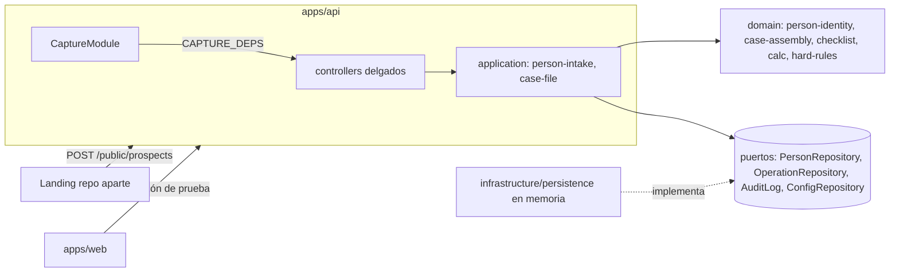

# Design: intake-and-case-assembly

## Arquitectura

## Decisiones

1. **Un solo repositorio de personas (F1).** `ProspectsModule`, `PersonsModule` y `OperationsModule` reciben el mismo `CaptureDeps` (módulo global, token explícito `CAPTURE_DEPS`). Se borra `InMemoryProspectStore`.
2. **Reglas en dominio, orquestación en application.** El dominio decide: estado inicial `PROSPECT`, DPI inmutable, código de checklist válido, motivo de «No aplica», regeneración del checklist, DPI del fiador, cobertura de listas de control, huecos y armado. Application valida la entrada, aplica RBAC, persiste y registra la bitácora. Los controladores solo traducen HTTP.
3. **Origen y autor no vienen del cuerpo.** El origen lo fija el canal (landing vs. agencia) y el autor la sesión. Así nadie registra «LANDING» desde la agencia ni firma por otro.
4. **Prospecto de landing sin DPI.** No se deduplica por teléfono (no es identidad). Se completa el DPI en su perfil; si ese DPI ya existe, se informa la persona dueña. Fusionar duplicados queda para un change posterior.
5. **Listas de control.** Por fuente vale la consulta más reciente (`checkedAt`). Solo `CLEAR` cuenta como consultada; `MATCH_FOUND` exige nota. Las fuentes requeridas vienen de `ConfigRepository` (`caseAssembly.watchlistSources`, semilla `WATCHLIST_SOURCES_SEED`). Ante la duda, avisar con hueco visible, no bloquear sin explicación.
6. **Constancia de armado.** `markAssembled` solo con cero huecos; cualquier cambio posterior la borra para que no quede una constancia vieja sobre un expediente distinto.
7. **Minimización de PII.** Directorio con DPI enmascarado; DPI completo solo en el perfil; búsqueda por DPI en el cuerpo (`POST /persons/lookup`). La semilla de demo usa DPI `0000…`.
8. **Pruebas sin build previo (F6).** `apps/api` y `apps/web` resuelven `@crece/*` desde `src` en Vitest; los archivos de prueba son `*.test.ts` como en el resto del repo.
9. **UI.** Componentes del bundle del design system vía `window.Crece` (`lib/crece-ds.tsx`), publicado en `/ds` por `scripts/sync-design-system.mjs` en `dev` y `build`. Sin Tailwind ni fuentes externas. La web no calcula ni decide: el checklist de vista previa, el cálculo y `canEdit` vienen de la API.

## Riesgos

- La memoria de proceso se pierde al reiniciar la API: aceptable hasta el change de persistencia.
- La sesión por cabeceras se puede falsificar: no desplegar sin `AuthGateway`.
- Al recalcular, `hardRuleHits` se reemplaza; cuando existan excepciones justificadas (fase 4) habrá que conservarlas.
